# ISCTF2022-WriteUp

## Misc

### 简单社工

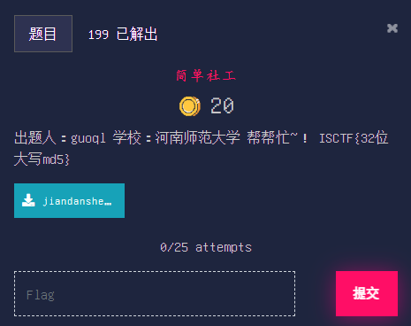

```markdown
出题人：guoql

学校：河南师范大学

帮帮忙~！ ISCTF{32位大写md5}
```

[题目附件](Misc/简单社工/files/jiandanshegong.zip)

### Welcome To ISCTF2022


```markdown
欢迎来到ISCTF2022，关注公众号回复即可得到flag，听说去年是回复`ISCTF`，今年回复`ISCTF****`就可以了，你问`*`是啥？我也忘了


```

### KFC疯狂星期四


```markdown
出题人：伽罗

学校：河南司法警官职业学院

打CTF必须要懂周四需要做的事情....
```

[题目附件](Misc/KFC疯狂星期四/files/Kfcdengkuangxingqisi.zip)

### 磁盘管理大师


```markdown
出题人：mumuzi

学校：四川警察学院

flag就在眼前
```

[题目附件](Misc/磁盘管理大师/files/flag.zip)

### 问卷

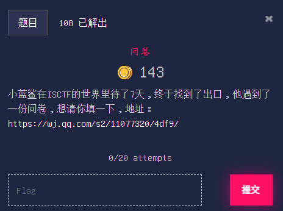

```markdown
小蓝鲨在ISCTF的世界里待了7天，终于找到了出口，他遇到了一份问卷，想请你填一下，地址：https://wj.qq.com/s2/11077320/4df9/
```

### 手残党福利

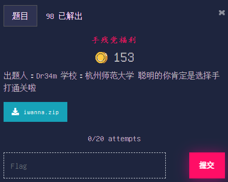

```markdown
出题人：Dr34m

学校：杭州师范大学

聪明的你肯定是选择手打通关啦
```

[题目附件](Misc/手残党福利/files/iwanna.zip)

### 可爱的emoji


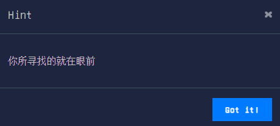

```markdown
出题人：g0at

学校：广东海洋大学

emoji可爱捏
```

```markdown
KEY★★★★★（★为纯字母）
```

```markdown
你所寻找的就在眼前
```

[题目附件](Misc/可爱的emoji/files/keaideemoji.zip)

### 小蓝鲨藏哪了呢


```markdown
出题人：Dr34m

学校：杭州师范大学

层层套路青春版 打开靶机之后请耐心等待一会儿会儿
```

### 两层编码


```markdown
出题人：Dr34m

学校：杭州师范大学

nc
```

```markdown
因为第二关加了5s的限制，所以从人体构造上来讲是不够你进行手操的，所以去简单学习一下Python的pwntools库的最基本的接受和传送数据的用法吧
```

### 我的Minecraft去哪了


```markdown
出题人：f00001111

学校：大理大学

f00001111入正了正版Minecraft，当他用新的账号登录他玩了几年的服务器时，却意外的发现他的东西全没了，经过查询，他发现正版账号有了新的UUID，你能帮他找到原来的UUID吗？

flag格式：ISCTF{md5(原UUID+新UUID)}

UUID格式为去除连接符后的32位数字及小写字符
```

### 放松一下


```markdown
出题人：guoql

学校：河南师范大学

链接：https://share.weiyun.com/ge2zY6iH
```

### 老色批了奥


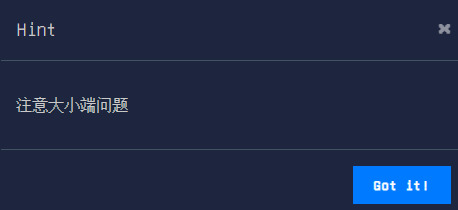

```markdown
出题人：guoql

学校：河南师范大学
```

```markdown
注意大小端问题
```

[题目附件](Misc/老色批了奥/files/attachment.zip)

### QQ机器人

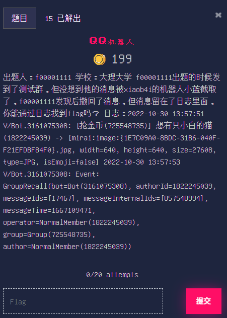

```markdown
出题人：f00001111

学校：大理大学

f00001111出题的时候发到了测试群，但没想到他的消息被xiaob4i的机器人小蓝截取了，f00001111发现后撤回了消息，但消息留在了日志里面，你能通过日志找到flag吗？

日志：2022-10-30 13:57:51 V/Bot.3161075308: \[抢金币(725548735)] 想有只小白的猫(1822245039) -> \[mirai:image:{1E7C09A0-8BDC-31B6-040F-F21EFDBF84F0}.jpg, width=640, height=640, size=27608, type=JPG, isEmoji=false]
2022-10-30 13:57:53 V/Bot.3161075308: Event: GroupRecall(bot=Bot(3161075308), authorId=1822245039, messageIds=\[17467], messageInternalIds=\[857548994], messageTime=1667109471, operator=NormalMember(1822245039), group=Group(725548735), author=NormalMember(1822245039))
```

### Kaspersky Rescue disk file


```markdown
出题人：mumuzi

学校：四川警察学院

decrypt it!注意格式为ISCTF{}
```

[题目附件](Misc/Kaspersky%20Rescue%20disk%20file/files/myflag.klr.enc1)

### 小蓝鲨的秘密


```markdown
出题人：XH

学校：信阳师范学院
```

[题目附件](Misc/小蓝鲨的秘密/files/OurSecret.zip)

### ISCTF World


```markdown
出题人：f00001111

学校：大理大学

小蓝鲨在ISCTF的世界里已经7天了，据说这里有一个flag在闪，你能找到吗 链接：https://share.weiyun.com/JaUv1bTD
```
### 酱紫乱


```markdown
出题人：mumuzi

学校：四川警察学院

好像得用脚本
```

[题目附件](Misc/酱紫乱/files/challenge.zip)

### Docker网络测试


```markdown
出题人：f00001111

学校：大理大学

ISCTF报名人数突破1000人，为了保证比赛过程中动态题目环境正常，f00001111准备了两台阿里云服务器，使用了Docker Swarm进行连接，但连接出了点问题，于是他在本地进行了测试，测试过程中他放了flag进去，你能通过流量找到flag吗？
```

[题目附件](Misc/Docker网络测试/files/flag.pcapng)

### 捕风的魔女

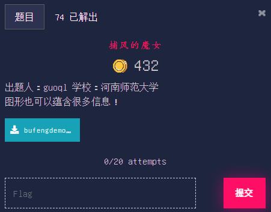

```markdown
出题人：guoql

学校：河南师范大学

图形也可以蕴含很多信息！
```

[题目附件](Misc/捕风的魔女/files/bufengdemonv.zip)

### 一个misc手会不懂web吗


```markdown
出题人：Dr34m

学校：杭州师范大学

原汁原味的盲注
```

[题目附件](Misc/一个misc手会不懂web吗/files/flag.pcapng)

### give_your_color_cc


```markdown
出题人：Dr34m

学校：杭州师范大学

看看涩图
```

```markdown
注意一下Linux终端字体颜色，再进行最基础的转换就好了
```

### 人生有输有赢


```markdown
出题人：tacooo0o

学校：西安邮电大学

植物大战僵尸~~~
```

[题目附件](Misc/人生有输有赢/files/renshengyoushuyouying.zip)

### Serevr_Forensics

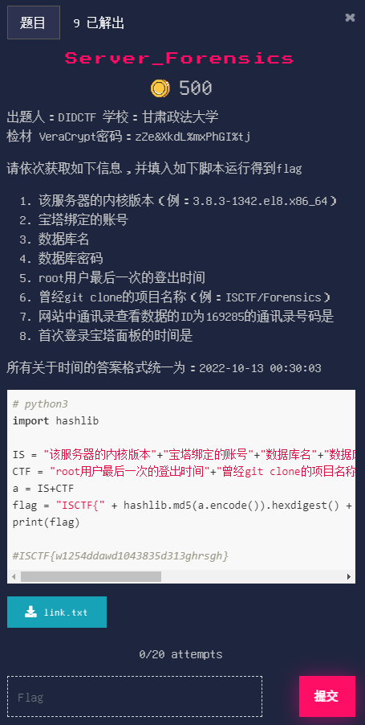

```markdown
出题人：DIDCTF

学校：甘肃政法大学  

检材 VeraCrypt密码：zZe&XkdL%mxPhGI%tj

请依次获取如下信息，并填入如下脚本运行得到flag

1. 该服务器的内核版本（例：3.8.3-1342.el8.x86_64）
2. 宝塔绑定的账号
3. 数据库名
4. 数据库密码
5. root用户最后一次的登出时间
6. 曾经git clone的项目名称（例：ISCTF/Forensics）
7. 网站中通讯录查看数据的ID为169285的通讯录号码是
8. 首次登录宝塔面板的时间是

所有关于时间的答案格式统一为：2022-10-13 00:30:03

\```python
# python3
import hashlib

IS = "该服务器的内核版本"+"宝塔绑定的账号"+"数据库名"+"数据库密码"
CTF = "root用户最后一次的登出时间"+"曾经git clone的项目名称"+"网站中通讯录查看数据的ID为169285的通讯录号码是"+"首次登录宝塔面板的时间是"
a = IS+CTF
flag = "ISCTF{" + hashlib.md5(a.encode()).hexdigest() + "}"
print(flag)

#ISCTF{w1254ddawd1043835d313ghrsgh}
\```
```

[题目附件](Misc/Server_Forensics/files/link.txt)

### 层层套路


```markdown
出题人：Dr34m

学校：杭州师范大学

一层层剥开你的心，发现你的心循环了100次 若访问链接没有出现附件，请耐心等待10s 不行就手lu呗
```

```markdown
可以使用爆破，来尝试找到 try: xxxxxx
```

```markdown
观察前四个进行了什么操作，从而推断之后会进行什么操作，再联系hint1
```

### 进来被骗！


```markdown
出题人：g0at

学校：广东海洋大学

别纠结emoji了，大家来看一下这个捏~ flag以ISCTF{}格式提交
```

[题目附件](Misc/进来被骗！/files/jinlaibeipian.zip)

### 套神看了都摇头


```markdown
出题人：Dr34m

学校：杭州师范大学

一个为了套而套的题，其实挺没有意思，为了覆盖到更大的知识面，可以尝试一下，如果在做题过程中感受到恶心，想吐，那请您即时就医。

题目链接：https://share.weiyun.com/iorrGPAd 密码：np6595
```

```markdown
高度只要修改前两位就行，不要修改后两位
```

```markdown
aes 加密使用的是https://www.sojson.com/encrypt_aes.html这个网站 在解码成AES的时候，会出现\n，请将\n给转成换行
```

```markdown
https://blog.csdn.net/qq_42880719/article/details/117304586
```

```markdown
passphrase 为默认密码
```

### Minecraft后门


```markdown
出题人：f00001111

学校：大理大学

f00001111去了一个新的服务器，在那里他打不过怪物，于是他骗腐竹安装了他的后门插件，并通过后门插件获取到了OP，他把消息告诉了xiaob4i并邀请xiaob4i一起来玩，但是他并没有告诉xiaob4i细节，而是给了xiaob4i服务器的内存镜像，你能帮小白找到获得OP的方法吗？

flag格式：ISCTF{xiaob4i获取OP的命令}，例：ISCTF{/op xiaob4i}

链接：https://share.weiyun.com/Pd3La14H
```

### 东南亚好玩吗？来南非看看吧


```markdown
出题人：guoql

学校：河南师范大学

逃亡2！你能逃离南非公司的魔爪吗？
```

[题目附件](Misc/东南亚好玩吗？来南非看看吧/files/zip)

### 层层迷宫

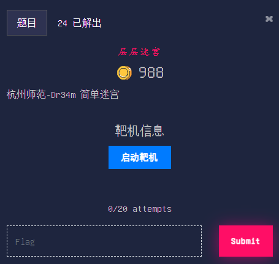

```markdown
杭州师范-Dr34m

简单迷宫
```

## Web

### EASY-PHP01

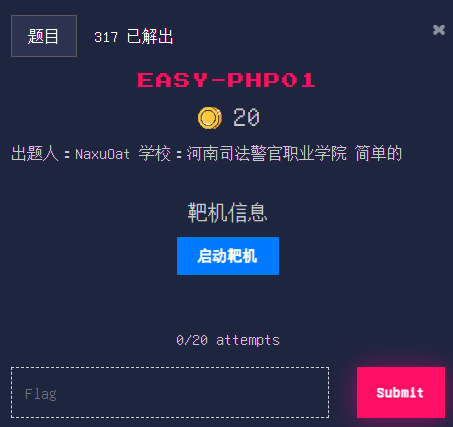

```markdown
出题人：NaxuOat

学校：河南司法警官职业学院

简单的
```

### EASY-PHP02

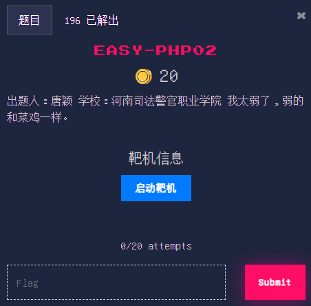

```markdown
出题人：唐颖

学校：河南司法警官职业学院

我太弱了，弱的和菜鸡一样。
```

### FakeWeb

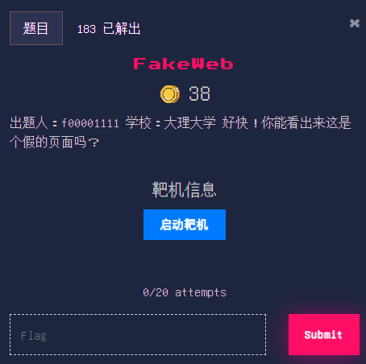

```markdown
出题人：f00001111

学校：大理大学

好快！你能看出来这是个假的页面吗？
```

### simplephp


```markdown
出题人：rayob

学校：成都东软学院

simplephp
```

### curl

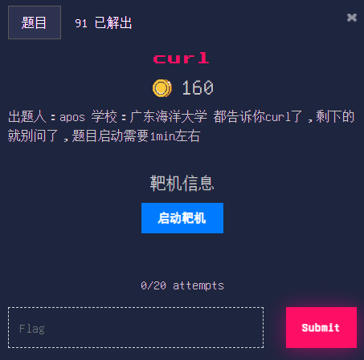

```markdown
出题人：apos

学校：广东海洋大学

都告诉你curl了，剩下的就别问了，题目启动需要1min左右
```

### easy-onlineshell

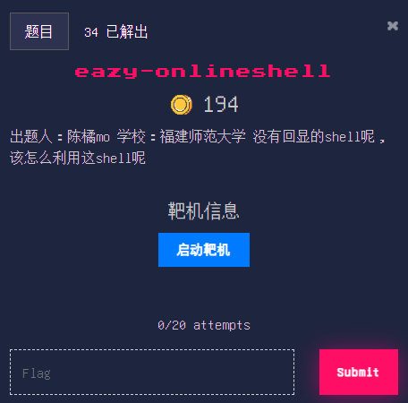

```markdown
出题人：陈橘mo

学校：福建师范大学

没有回显的shell呢，该怎么利用这shell呢
```

### easy_upload


```markdown
出题人：R.zz

学校：云南警官学院

一道普普通通的文件上传罢了
```

### crazy-onlineshell


```markdown
出题人：陈橘mo

学校：福建师范大学

没有回显的shell呢，而且还加了黑名单限制
```

### 傻柱

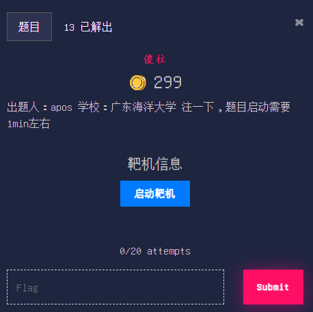

```markdown
出题人：apos

学校：广东海洋大学

注一下，题目启动需要 1min左右
```

### 猫和老鼠

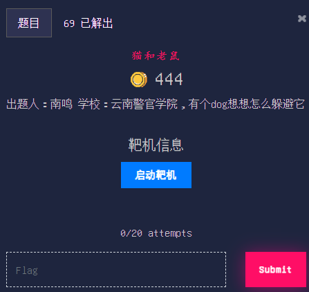

```markdown
出题人：南鸣

学校：云南警官学院

有个dog想想怎么躲避它
```

### rce？

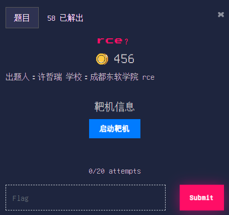

```markdown
出题人：许哲瑞

学校：成都东软学院

rce
```

### upload


```markdown
出题人：许哲瑞

学校：成都东软学院

upload
```

[题目附件](Web/upload/files/www.zip)

## Crypto

### 这是什么古典玩意


```markdown
出题人：mumuzi

学校：四川警察学院

一种简单的编码
```

[题目附件](Crypto/这是什么古典玩意/files/ez_cry.zip)

### 呜呜呜我的md5脏了


```markdown
出题人：g0at

学校：广东海洋大学

md5被打乱了捏
```
[题目附件](Crypto/呜呜呜我的md5脏了/files/wuwuwuwodemd5zangl.txt)

### 咦 这个密码 怎么怪怪的


```markdown
出题人：g0at

学校：广东海洋大学

简单的base
```

[题目附件](Crypto/咦%20这个密码%20怎么怪怪的/files/base.txt)

### babyrsa


```markdown
出题人:Y0ng

单位安徽工业经济职业技术学院

你真的会rsa吗

flag格式为:blueshark{xxxxxx}
```

[题目附件](Crypto/babyrsa/files/text.py)

### ezcry


```markdown
出题人：XH

学校：信阳师范学院
```

[题目附件](Crypto/ezcry/files/ezcry.py)

### 韩信点兵


```markdown
出题人：guoql

学校：河南师范大学

韩信在练兵的时候好像遇到了些困难？看看他怎么解决的吧
```

[题目附件](Crypto/韩信点兵/files/hanxindianbing.zip)

### 蓝鲨密码


```markdown
出题人：g0at

学校：广东海洋大学

你见过蓝鲨密码吗？
```

[题目附件](Crypto/蓝鲨密码/files/txt)

### easy_AES


```markdown
出题人：Nuyoah

学校：河南司法警官职业学院

easy_AES
```

```markdown
第一个密文是异或加密的密文，第二个密文是aes密文
```

### ezRSA


```markdown
出题人：g0at

学校：广东海洋大学

小蓝鲨被这道题目难住了，你能帮帮他吗？
```

[题目附件](Crypto/ezRSA/files/ezRSA1.py)

### ezzzzzzzzzzzzzzzzzlattice


```markdown
出题人：mxx307

学校：杭州师范大学
```

## Reverse

### SigninReverse

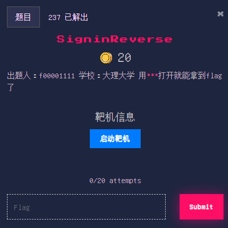

```markdown
出题人：f00001111

学校：大理大学

用`***`打开就能拿到flag了
```

### ezbase


```markdown
出题人：g0at

学校：广东海洋大学

一个简单的 base 加密
```

[题目附件](Reverse/ezbase/files/ezbase.exe)

### 坤坤的csgo邀请


```markdown
出题人：swa9

学校：平顶山学院

坤坤邀请你打see♂ass♂go。
```

[题目附件](Reverse/坤坤的csgo邀请/files/re.zip)

### base64

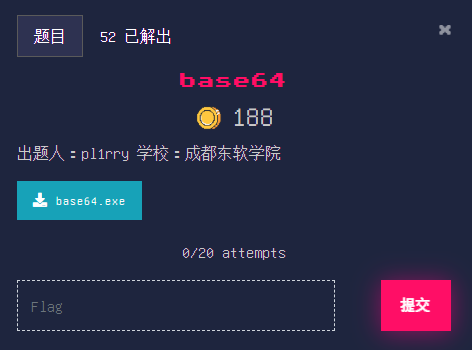

```markdown
出题人：pl1rry

学校：成都东软学院
```

[题目附件](Reverse/base64/files/base64.exe)

### easyVM


```markdown
出题人：pl1rry

学校：成都东软学院
```

[题目附件](Reverse/easyVM/files/EasyyyyyyVM.exe)

### 5121-babyre


```markdown
出题人：tacooo0o

学校：西安邮电大学

BCD
```

[题目附件](Reverse/5121-babyre/files/5121-babyre.zip)

### babyopcode


```markdown
出题人：tacooo0o

学校：西安邮电大学

不会就猜呗
```

[题目附件](Reverse/babyopcode/files/xxx.zip)

### 开摆re

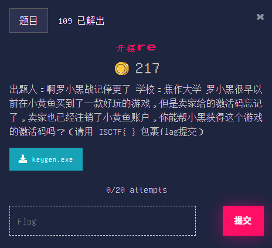

```markdown
出题人：啊罗小黑战记停更了

学校：焦作大学

罗小黑很早以前在小黄鱼买到了一款好玩的游戏，但是卖家给的激活码忘记了，卖家也已经注销了小黄鱼账户，你能帮小黑获得这个游戏的激活码吗？（请用 ISCTF{ } 包裹flag提交）
```

[题目附件](Reverse/开摆re/files/keygen.exe)

### 请送我一个绿茶


```markdown
出题人：thestar

学校：成都东软学院

一个标准的pyd逆向，标准的xxtea加密
```

[题目附件](Reverse/请送我一个绿茶/files/fujian.txt)

[题目附件](Reverse/请送我一个绿茶/files/green_tea.exe)

### final


```markdown
出题人：final

学校：成都东软学院
```

[题目附件](Reverse/final/files/final.exe)

### easyopcode

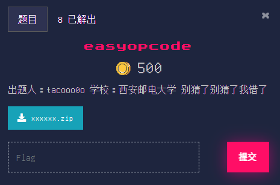

```markdown
出题人：tacooo0o

学校：西安邮电大学

别猜了别猜了我错了
```

[题目附件](Reverse/easyopcode/files/xxxxxx.zip)

### 青春re手不会梦到密码学学姐


```markdown
出题人：guoql

学校：河南师范大学

你知道模逆元是什么吗？
```

```markdown
最后一步均为小写字母
```

```markdown
不要管细枝末节，将主要内容逆出来后分析算法即可
```

[题目附件](Reverse/青春re手不会梦到密码学学姐/files/re.zip)

### simple_flower


```markdown
出题人：pl1rry

学校：成都东软学院

套上ISCTF{}后提交
```

[题目附件](Reverse/simple_flower/files/simple_flower.exe)

### Block

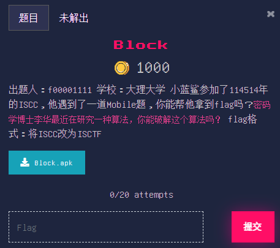

```markdown
出题人：f00001111

学校：大理大学

小蓝鲨参加了114514年的ISCC，他遇到了一道Mobile题，你能帮他拿到flag吗？`密码学博士李华最近在研究一种算法，你能破解这个算法吗？`

flag格式：将ISCC改为ISCTF
```

[题目附件](Reverse/Block/files/Block.apk)

## Pwn

### easy_ret2libc


```markdown
出题人：晨

学校：福建师范大学

%s在哪里呢
```

[题目附件](Pwn/easy_ret2libc/files/easy_ret2libc)

[题目附件](Pwn/easy_ret2libc/files/libc-2.27.so)

### inequable_ret2text

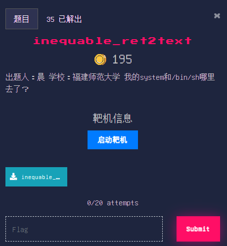

```markdown
出题人：晨

学校：福建师范大学

我的system和/bin/sh哪里去了？
```

[题目附件](Pwn/inequable_ret2text/files/inequable_ret2text)

### nc_pwn

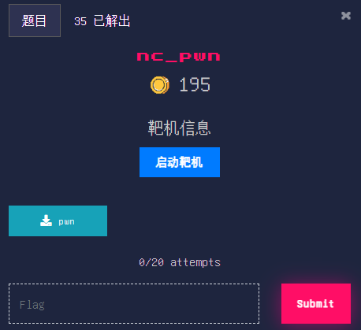

[题目附件](Pwn/nc_pwn/files/pwn)

### guess_number


```markdown
出题人：晨

学校：福建师范大学

来一场竞争刺激的猜数字吧！
```

[题目附件](Pwn/guess_number/files/guess_number)

[题目附件](Pwn/guess_number/files/libc-2.27.so)

### format_string


```markdown
出题人：晨

学校：福建师范大学

小心'\n'哦
```

[题目附件](Pwn/format_string/files/format_string)

### candy_house


```markdown
出题人：kotoriseed

学校：成都东软学院
```

[题目附件](Pwn/candy_house/files/candy_house)

### csu


```markdown
出题人:x1aob1n

单位:厦门理工学院
```

[题目附件](Pwn/csu/files/pwn)

### babycode


```markdown
出题人：CHEN

学校：hznu

len(shellcode)<?
```

[题目附件](Pwn/babycode/files/babycode)

### nothing_to_do


```markdown
出题人：kotoriseed

学校：成都东软学院
```

[题目附件](Pwn/nothing_to_do/files/nothing_to_do)

### null


```markdown
出题人：x1aob1n

单位：厦门理工学院
```

[题目附件](Pwn/null/files/null)

[题目附件](Pwn/null/files/libc-2.27.so)

## Iot

### 眼花缭乱

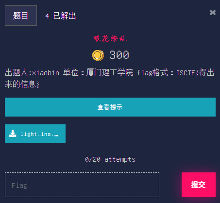


```markdown
出题人:x1aob1n

单位：厦门理工学院

flag格式：ISCTF{得出来的信息}
```

```markdown
avr架构固件. 这8个小灯泡，闪呀闪，到底在说什么话呢
```

### ezarm


```markdown
出题人x1aobin

单位厦门理工学院

该固件内部存在2个任务task1和task2，这两个任务采用某种系统中断，请求出该中断间隔(单位ms) 

这两个任务task1或者是task2他们任务内部都是在执行一个交替高低电平的操作，请求出交替间隔(单位ms)，设晶振频率为25M,机器周期为T × 12

flag格式:ISCTF{中断间隔/交替间隔}

例如中断间隔10ms，交替间隔0.5ms: ISCTF{10/0.5}

如果是小数则去0保留有效位数(例如0.55000,则0.55)，如果是整数则不保留
```

```markdown
任务切换采用systick，一次1ms

高低电平交替采用软件中断，中断一次的时间等于系统执行一次代码命令的时间
```

[题目附件](Iot/ezarm/files/eziot.hex)