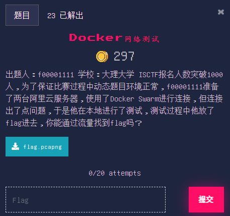

# Docker网络测试

## 题目

## 描述

出题人：f00001111

学校：大理大学

ISCTF报名人数突破1000人，为了保证比赛过程中动态题目环境正常，f00001111准备了两台阿里云服务器，使用了Docker Swarm进行连接，但连接出了点问题，于是他在本地进行了测试，测试过程中他放了flag进去，你能通过流量找到flag吗？

## 附件

[题目附件](files/flag.pcapng)