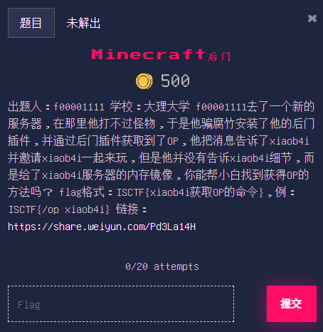

# Minecraft后门

## 题目

## 描述

出题人：f00001111

学校：大理大学

f00001111去了一个新的服务器，在那里他打不过怪物，于是他骗腐竹安装了他的后门插件，并通过后门插件获取到了OP，他把消息告诉了xiaob4i并邀请xiaob4i一起来玩，但是他并没有告诉xiaob4i细节，而是给了xiaob4i服务器的内存镜像，你能帮小白找到获得OP的方法吗？

flag格式：ISCTF{xiaob4i获取OP的命令}，例：ISCTF{/op xiaob4i}

链接：https://share.weiyun.com/Pd3La14H