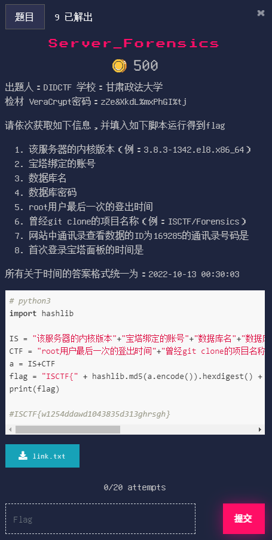

# Server_Forensics

## 题目



## 描述

出题人：DIDCTF

学校：甘肃政法大学  

检材 VeraCrypt密码：zZe&XkdL%mxPhGI%tj

请依次获取如下信息，并填入如下脚本运行得到flag

1. 该服务器的内核版本（例：3.8.3-1342.el8.x86_64）
2. 宝塔绑定的账号
3. 数据库名
4. 数据库密码
5. root用户最后一次的登出时间
6. 曾经git clone的项目名称（例：ISCTF/Forensics）
7. 网站中通讯录查看数据的ID为169285的通讯录号码是
8. 首次登录宝塔面板的时间是

所有关于时间的答案格式统一为：2022-10-13 00:30:03

```python
# python3
import hashlib

IS = "该服务器的内核版本"+"宝塔绑定的账号"+"数据库名"+"数据库密码"
CTF = "root用户最后一次的登出时间"+"曾经git clone的项目名称"+"网站中通讯录查看数据的ID为169285的通讯录号码是"+"首次登录宝塔面板的时间是"
a = IS+CTF
flag = "ISCTF{" + hashlib.md5(a.encode()).hexdigest() + "}"
print(flag)

#ISCTF{w1254ddawd1043835d313ghrsgh}
```

## 附件

[题目附件](files/link.txt)