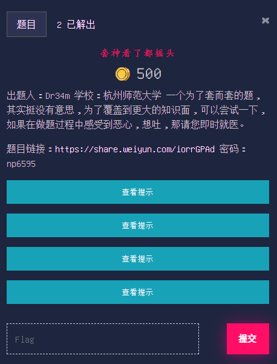
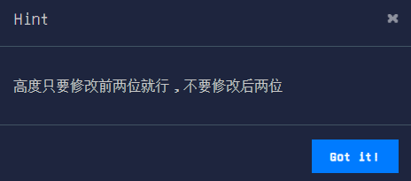

# 套神看了都摇头

## 题目

## 提示

## 描述

出题人：Dr34m

学校：杭州师范大学

一个为了套而套的题，其实挺没有意思，为了覆盖到更大的知识面，可以尝试一下，如果在做题过程中感受到恶心，想吐，那请您即时就医。

题目链接：https://share.weiyun.com/iorrGPAd 密码：np6595

>高度只要修改前两位就行，不要修改后两位

>aes 加密使用的是https://www.sojson.com/encrypt_aes.html这个网站 在解码成AES的时候，会出现\n，请将\n给转成换行

>https://blog.csdn.net/qq_42880719/article/details/117304586

>passphrase 为默认密码