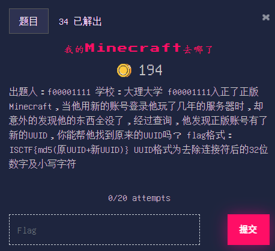

# 我的Minecraft去哪了

## 题目

## 描述

出题人：f00001111

学校：大理大学

f00001111入正了正版Minecraft，当他用新的账号登录他玩了几年的服务器时，却意外的发现他的东西全没了，经过查询，他发现正版账号有了新的UUID，你能帮他找到原来的UUID吗？

flag格式：ISCTF{md5(原UUID+新UUID)}

UUID格式为去除连接符后的32位数字及小写字符